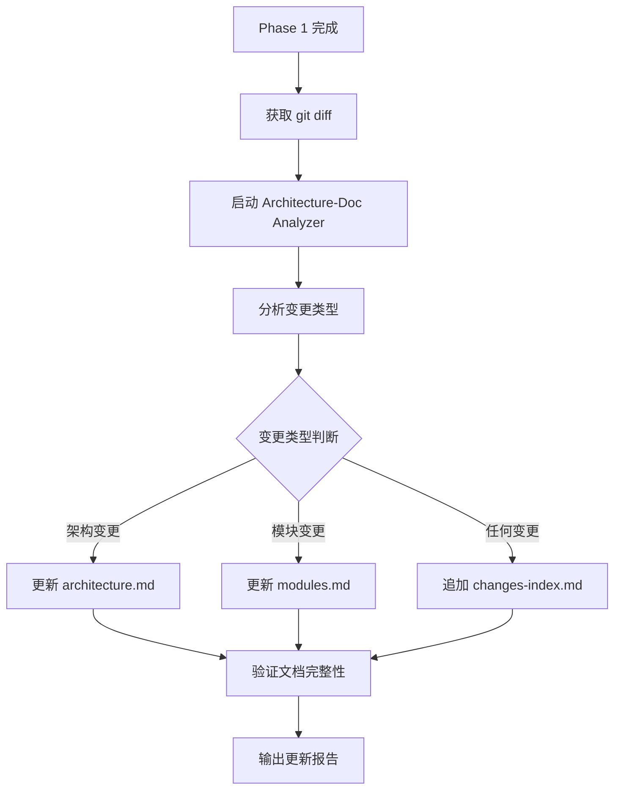

# Consistency Verification

Verify alignment between spec, design, code, and tests using parallel sub-agent analysis.

## Overview

Ensures traceability across all artifact layers - catching inconsistencies before they become production issues.

**Core principle:** Bidirectional verification - spec→design AND design→spec, not just presence checks.

## When to Use

- After executing-plans Phase 4 completes (automatic invocation)
- User requests verification of artifact consistency
- Suspected misalignment between specification and implementation
- User invokes `/ecf-verify`

## Arguments

- `[design-folder-path]`: Path to design folder containing spec and plan files
- If not provided: searches `docs/plans/` for latest `*-design/` directory

## Workflow

```
Parse path → Launch 3 parallel analyzers → Aggregate results → Phase 1 Report → Phase 2: Architecture-Doc Check → Final Report
```

## Verification Dimensions

| Analyzer | Checks |
|----------|--------|
| Spec-Design | Feature coverage, terminology consistency |
| Design-Code | Module existence, interface signatures |
| Spec-Test | Scenario coverage, test completeness |

## Execution Flow

**Step 1: Resolve Path**
```bash
# If argument provided
design_path="$ARGUMENTS"

# If no argument, find latest
design_path=$(ls -td docs/plans/*-design/ 2>/dev/null | head -1)

# Verify path exists
[ -d "$design_path" ] || echo "⚠️ Design folder not found: $design_path"
```

**Step 2: Launch Parallel Analyzers**

Use Agent tool to spawn 3 parallel subagents:
- Analyzer 1: Spec-Design alignment
- Analyzer 2: Design-Code alignment
- Analyzer 3: Spec-Test coverage

**Step 3: Aggregate Results**

Collect findings from all analyzers:
- Consistency score per dimension
- Inconsistency items with evidence (line numbers + excerpts)
- Severity classification (high/medium/low)

**Step 4: Output Report**

Save to `docs/plans/*-design/verification-report.md`:
```markdown
# Verification Report

## Summary
- Spec-Design: ✅/⚠️/❌
- Design-Code: ✅/⚠️/❌
- Spec-Test: ✅/⚠️/❌

## Findings
[List of inconsistencies with evidence]
```

## Phase 2: Architecture-Doc Consistency Check

总文档一致性检查，更新 docs/openspec/architectures/ 目录。

**触发条件**: Phase 1 完成后自动触发

**执行流程**:



**变更类型判断**:

| 变更信号 | 触发更新 |
|---------|---------|
| 技术栈变更 | architecture.md 技术栈表 |
| 新增目录 | modules.md 新增模块条目 |
| 删除目录 | modules.md 模块状态改为 archived |
| 核心入口变更 | modules.md 模块入口更新 |
| 接口契约变更 | modules.md 接口契约 |
| 任何变更 | changes-index.md 追加条目 |

**Analyzer 模板**: 见 [architecture-doc-analyzer.md](../ecf/references/consistency-verification/architecture-doc-analyzer.md)

**错误处理**:

| 异常情况 | 处理方式 |
|---------|---------|
| architectures 目录不存在 | 调用 ecf-init 创建 |
| 文档格式损坏 | 重建空白模板 |

## Fix Options

Per inconsistency item:
- **[A] 更新代码**: Modify code to match spec/design
- **[B] 更新文档**: Modify docs to match code
- **[跳过]**: Record but don't fix (max 20%, high-impact items cannot skip)
- **[重新验证]**: Re-run analyzer

**知识检索集成**: 遇到不一致项时，自动检索 `docs/solutions/` 寻找历史修复方案。

```bash
# 在展示 Fix Options 前
if [ -f "../.claude/.ecf-degraded.flag" ]; then
    : # degraded 模式，跳过检索
else
    # 根据不一致类型检索解决方案
    for item in "${inconsistencies[@]}"; do
        severity=$(echo "$item" | jq -r '.severity')
        desc=$(echo "$item" | jq -r '.description')
        # 抽取关键词检索
        results=$(grep -ril "$(echo "$desc" | cut -d' ' -f1-3)" docs/solutions/ 2>/dev/null)
        if [ -n "$results" ]; then
            echo "📚 知识库发现相关历史方案，可作为修复参考"
        fi
    done
fi
```

**匹配行为**:
| 情况 | 行为 |
|------|------|
| 匹配到历史方案 | 推荐对应 Fix Option + 方案参考 |
| 无匹配 | 显示标准的 Fix Options |
| degraded 模式 | 跳过检索 |

详见 [knowledge-retrieval.md](../ecf/references/knowledge-retrieval.md) 的"自动异常场景检索"章节。

## Red Flags - STOP

- "Tests pass, so it must be consistent"
- "The code looks correct"
- "I can just scan quickly"
- "Developer just finished, probably fine"
- "I'll compare in my head"

**遇到以上情况**: 执行完整 traceability matrix 分析，不可跳过。

## Common Mistakes

| Mistake | Fix |
|---------|-----|
| Keyword matching instead of semantic analysis | Parse intent, not just text |
| Presence checks without correctness | Verify functionality matches |
| Single-direction verification | Bidirectional: spec→design AND design→spec |
| No evidence output | Line numbers + content excerpt required |

## Verification Completion Validation

After all verification phases complete, run final self-validation:

```bash
🔍 验证完成验证
━━━━━━━━━━━━━━━━━━━━━━━━━━━━━
✓ 设计路径存在且有效 ✅
✓ 三个并行分析器执行完成 ✅
✓ 结果聚合完成 ✅
✓ 验证报告已写入且非空 ✅
✓ 架构文档一致性检查完成（如需要）✅
━━━━━━━━━━━━━━━━━━━━━━━━━━━━━
✅ 验证通过，验证层完成
```

**If any check fails**:
- Interrupt workflow
- Report which check failed
- Do not proceed to archive or knowledge layer

## Summary Output

```
📊 Verification Summary
━━━━━━━━━━━━━━━━━━━━
Phase 1 - Artifact Alignment:
  Spec-Design: [score]
  Design-Code: [score]
  Spec-Test: [score]

Phase 2 - Architecture-Doc:
  变更类型: [count] 个
  文档更新: architecture.md / modules.md / changes-index.md
  完整性: ✅/⚠️
━━━━━━━━━━━━━━━━━━━━
[✅ All aligned / ⚠️ N inconsistencies found]
```

## References

- [phase-completion-validation.md](../ecf/references/phase-completion-validation.md) - 阶段完成验证统一规则
- [analyzer-templates.md](../ecf/references/consistency-verification/analyzer-templates.md) - Sub-agent prompt templates
- [report-format.md](../ecf/references/consistency-verification/report-format.md) - Report structure