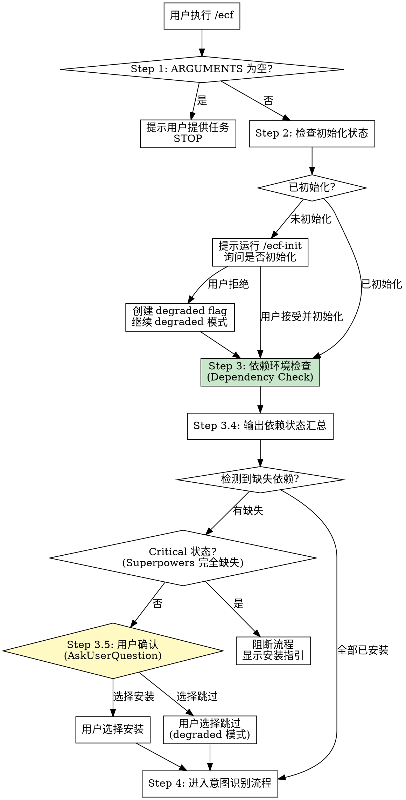
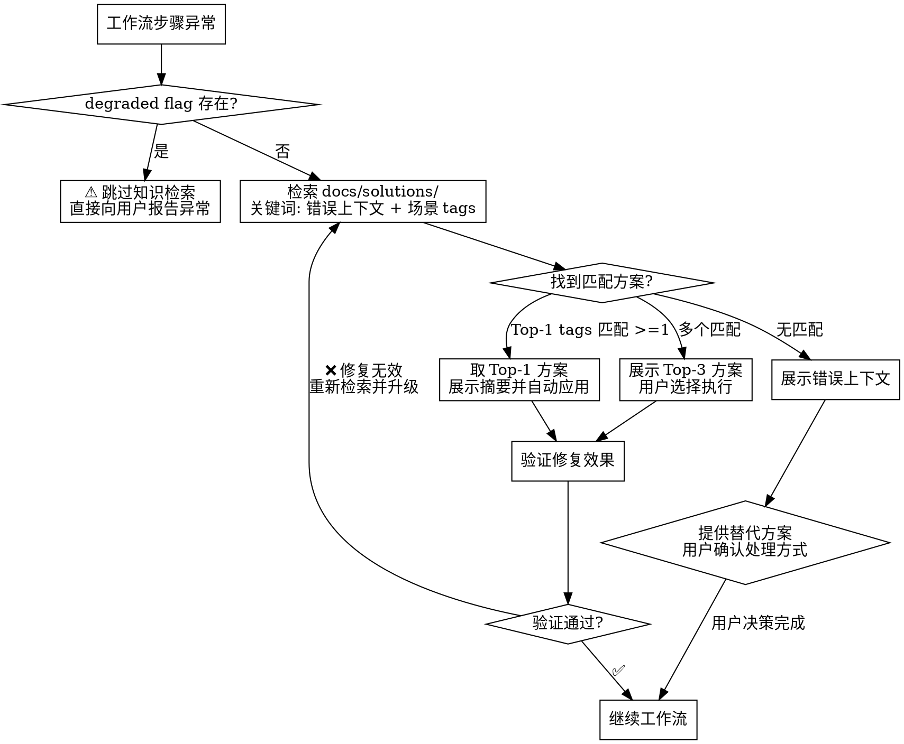

# EasyCodingFlow 编排

## Overview

统一的 Agent 协作编排 skill，整合 Superpowers、OpenSpec、Compound Engineering。

**Core principle**: 每个请求必须先经过意图识别，再路由到工作流。

## Entry Point

User provided arguments: `$ARGUMENTS`

### Pre-flight Check (REQUIRED FIRST)

**⚠️ 必须在任何工作流之前执行此检查序列。**

**Violating the letter of this process is violating the spirit of ecf.**



#### Step 1: Empty Arguments Check

If `$ARGUMENTS` is empty or whitespace-only:

```
🔍 Agent-Teams 帮手

请提供具体任务，例如：
• bug fix [问题描述] - 修复某个问题
• 开发新功能 [功能描述] - 实现某个功能
• review [范围] - 代码审查
• 重构 [模块] - 代码重构
• 文档更新 - 更新文档
• 测试补齐 - 补充测试用例

输入 /ecf-init 可初始化项目结构。
```

**STOP here** - wait for user input. Do NOT proceed to intent recognition.

**No exceptions:**
- Don't try to guess what user wants
- Don't proceed with empty task
- Don't invoke other skills without user input

#### Step 2: Initialization Check

Check required directories exist:
- `docs/solutions/` (knowledge base) - Required
- `.claude/ecf_config.yaml` (project config) - Required

**If missing required items:**
```
⚠️ 项目未初始化
缺失: [list of missing items]

建议运行: /ecf-init
```

Ask user: "是否现在初始化项目?"
- User says "yes" → Invoke `ecf-init` skill
- User says "no" → Create `.claude/.ecf-degraded.flag`, proceed with degraded mode

**Degraded Mode Behavior:**
- Knowledge retrieval disabled
- OpenSpec storage disabled
- Intent recognition continues normally
- Warning shown: `⚠️ 知识检索功能不可用`

#### Step 3: Dependency Environment Check

**⚠️ 依赖环境检测统一由 ecf-init 执行。**

依赖检测逻辑已统一到 `ecf-init` skill，作为唯一权威来源。
详细检测命令和安装指引见 [ecf-init/SKILL.md](../../ecf-init/SKILL.md#environment-check-pre-flight) 和 [dependency-check.md](references/dependency-check.md)。

**快速检测脚本** (引用 ecf-init 检测逻辑):

```bash
# 使用 ecf-init 的检测命令，输出统一格式的依赖状态
# 完整环境和安装流程请运行: ecf-init --auto-install
```

**依赖汇总** (检测项，检测方法来自 ecf-init):

| 依赖 | 检测位置 | 影响层级 |
|------|----------|----------|
| OpenSpec CLI + Skills | 项目级 `.claude/skills/openspec-*` | Contract Layer |
| Compound Engineering | `~/.claude/plugins/cache/compound-engineering-plugin/` | Knowledge Layer |
| Superpowers@frad-dotclaude | `CLAUDE_PLUGIN_ROOT` + `setup-superpower-loop.sh` | Execution Layer |
| skill-creator | `~/.claude/skills/skill-creator/` 或 `~/.claude/plugins/cache/claude-plugins-official/skill-creator/` | Skills Development |

**用户确认 Matrix** (同 ecf-init 定义):

| 依赖缺失类型 | 状态级别 | 用户选项 |
|--------------|----------|----------|
| OpenSpec Skills | Warning | 运行 `ecf-init --auto-install` / 跳过 (Brainstorming 替代) |
| Compound Engineering | Warning | 运行 `ecf-init --auto-install` / 跳过 (直接写入 docs/solutions/) |
| skill-creator | Warning | 运行 `ecf-init --auto-install` / 跳过 (仅 skill_development 场景需要) |
| Superpowers (frad 未安装) | Warning | 运行 `ecf-init --auto-install` / 跳过 (官方版本 fallback) |
| Superpowers (完全未安装) | **Critical** | 阻断流程，运行 `ecf-init --auto-install` |

##### Dependency Status Summary

```
🔍 Dependency Check Summary
━━━━━━━━━━━━━━━━━━━━━━━━━━━━━
OpenSpec Skills:      [状态]
Compound Engineering: [状态]
Superpowers:          [状态]
skill-creator:        [状态]
━━━━━━━━━━━━━━━━━━━━━━━━━━━━━
[如有缺失，建议运行: ecf-init --auto-install]
```

##### Step 3.5: Dependency Confirmation

**⚠️ 检测到缺失依赖时，引导用户使用 ecf-init 安装。**

缺失依赖时的用户确认已统一到 ecf-init 的 Auto-Install 流程。在 ecf Pre-flight 中：

1. 检测到缺失 → 提示用户运行 `ecf-init --auto-install`
2. 用户选择跳过 → 使用 degraded 模式（具体 fallback 策略见 ecf-init 用户确认 Matrix）

**Degraded 模式警告**:
```
⚠️ Degraded 模式运行
已跳过的依赖: [列表]
功能限制: [说明 fallback 策略]
如需重新安装请运行: ecf-init --auto-install
```

#### Step 4: Proceed to Intent Recognition

**Only after pre-flight checks (Steps 1-3) pass**, proceed to Intent Recognition Flow below.

**意图识别必须由当前 agent 直接执行**，不需要调用外部 Agent 或 API。当前 Claude Code session 已具备完整意图理解能力。

**必须按照以下输出模板输出**，完成后再路由到下一步：

```
意图识别
任务分析: <task description>
  - 关键词: <extracted keywords 逗号分隔>
  - 场景类型: <type> (<description>)
  - 标准工作流: <workflow steps from mapping table>

路由决策: <routing reason>
  → 契约层入口: <entry point>
```

**示例输出 1**:
```
意图识别
任务分析: 重构 parallel_state.py 的 initialize_model_parallel_wrapper 方法
  - 关键词: 重构, 抽取公共逻辑, 高内聚低耦合
  - 场景类型: refactor (代码重构)
  - 标准工作流: brainstorming → writing-plans → ecf-execute → ecf-verify → ce:compound

路由决策: 根据场景路由表，refactor 不需要 OpenSpec 变更管理
  → 契约层入口: superpowers:brainstorming
```

**示例输出 2**:
```
意图识别
任务分析: 优化 ecf skill 的意图识别输出格式，修复输出不符合要求问题
  - 关键词: 优化, skills, 技能, SKILL.md, 输出格式
  - 场景类型: skill_development (技能开发)
  - 标准工作流: /opsx:propose → skill-creator → skill-quality-verification → /opsx:archive → ce:compound

路由决策: skill_development 需要完整变更管理流程
  → 契约层入口: /opsx:propose
```

完整规范见 [intent-recognition.md](references/intent-recognition.md)。

**关键词匹配优先级规则**:
- **最高优先级**: 如果包含 ANY skill 相关关键词 → **强制优先匹配 skill_development**
  - 关键词列表: `skill`, `skills`, `技能`, `SKILL.md`, `优化技能`, `技能优化`, `技能开发`, `技能修复`, `技能bug`, `技能评估`, `skill-creator`, `skill-quality-verification`
  - 即使同时包含 `bug`, `fix`, `修复`, `review` 等其他关键词，仍然优先匹配 `skill_development`
  - 原因: **所有技能相关修改必须走 skill-creator TDD 流程，禁止直接走 bug_fix/code_review 流程**
- 如果仅包含 "优化" 但无 skill 相关关键词 → 根据上下文匹配 incremental 或 refactor

**契约层入口路由决策表**:

| 场景类型 | 契约层入口 | 说明 |
|----------|------------|------|
| new_feature | `/opsx:propose` | 需要 OpenSpec 变更管理 |
| skill_development | `/opsx:propose` | 需要 OpenSpec 变更管理 |
| incremental | `/opsx:propose` | 需要 OpenSpec 变更管理 |
| refactor | `Skill("superpowers:brainstorming")` | **不需要 OpenSpec**，直接 brainstorming |
| bug_fix | **跳过契约层** | 直接执行层 |
| code_review | **跳过契约层** | 直接执行层 |
| test_coverage | **跳过契约层** | 直接执行层 |
| documentation | **跳过契约层** | 直接执行 |

**关键区分**:
- `/opsx:propose` 用于需要变更管理的场景（后续需要 `/opsx:archive`）
- `brainstorming` 用于需要规划但不需要变更管理的场景
- bug_fix/code_review 等跳过契约层，直接进入执行层

---

## Pre-flight Check Completion Validation

```bash
🔍 Pre-flight 完成验证
━━━━━━━━━━━━━━━━━━━━━━━━━━━━━
✓ 参数检查完成: ARGUMENTS 非空 ✅
✓ 初始化状态检查完成 ✅
✓ 依赖环境检查完成 ✅
✓ 缺失依赖处理完成 ✅
━━━━━━━━━━━━━━━━━━━━━━━━━━━━━
✅ 验证通过，进入意图识别阶段
```

**验证规则** (详见 [phase-completion-validation.md](references/phase-completion-validation.md)):
- 所有检查项完成 → 继续
- 任何检查项未完成 → 中断流程，报告失败

## Red Flags - Pre-flight

If you find yourself thinking:
- "I'll skip the empty check and proceed anyway"
- "User probably wants to do X, let me start"
- "Dependency check is optional - I'll skip it"

**STOP. These are violations.** Return to Pre-flight Check Step 1.

## When to Use

| 场景 | 关键词 |
|------|--------|
| 新需求开发 | 开发、新功能、实现、创建 |
| Bug修复 | bug、报错、失败、修复 |
| 代码重构 | 重构、优化结构 |
| Code Review | review、审查 |
| 文档更新 | 文档、readme |
| 用例补齐 | 测试、用例、coverage |
| 知识检索 | 之前、类似、历史 |

## Architecture

```
Layer 0: 编排层 (Intent → Route → Team → Monitor)
Layer 1: 规范契约层 (OpenSpec / Brainstorming)
Layer 2: 执行层 (Writing-Plans → Executing-Plans + EasyCodingFlow)
Layer 2.5: 验证层 (Consistency-Verification + Architecture-Doc Update)
Layer 3: 知识沉淀层 (Compound)
```

**Order**: 必须按层顺序执行。Bug修复可跳过 Layer 1。

**并发执行**: Layer 2 使用 `superpowers:agent-team-driven-development` 实现真正的并发。

## Parallel Execution

**⚠️ 执行层必须使用并发能力提升效率。**

| 任务数量 | 执行模式 | Agent 通信 |
|----------|----------|------------|
| >6 独立任务 | Agent Team | ✅ 可互发消息 |
| ≤6 独立任务 | Subagent | ❌ 仅返回调用者 |
| 1 任务 | Linear | ❌ 无 |
| 配对 | Red-Green Pair | ✅ 配对内顺序 |

**必加载 Skills** (仅当使用 team 模式时):
1. `superpowers:agent-team-driven-development`
2. `superpowers:behavior-driven-development`

**执行技能**: `/ecf-execute [plan-path]`

详细流程见 [parallel-execution.md](references/parallel-execution.md)。

## Workflow

核心工作流表格。**完整定义见 [workflow-templates.md](references/workflow-templates.md)**。

| Scenario | Workflow |
|----------|----------|
| 新需求开发 | `/opsx:propose` → `brainstorming` → `writing-plans` → **`ecf-execute`** → **`ecf-verify`** → **`/opsx:archive`** → `ce:compound` |
| Bug修复 | `systematic-debugging` → fix → **`ecf-verify`** → `ce:compound` |
| 代码重构 | `brainstorming` → `writing-plans` → **`ecf-execute`** → **`ecf-verify`** → `ce:compound` |
| Code Review | **`ce-review`** → `ce:compound` |
| Skills开发 | `/opsx:propose` → **`skill-creator`** → **`skill-quality-verification`** → **`/opsx:archive`** → `ce:compound` |

**关键说明**:
- **Archive 步骤**: OpenSpec 发起的变更必须调用 `/opsx:archive` 完成闭环
- **Skills开发特例**: 执行层使用 `skill-creator`，验证层使用 `skill-quality-verification`
- **执行入口**: 必须使用 `/ecf-execute`（强制并发）
- **⚠️ ce:compound 不可跳过**: 所有工作流最后一步必须调用 `ce:compound`，跳过会导致知识无法沉淀

**工作流完成检查**: 使用 [workflow-completion-checklist.md](references/workflow-completion-checklist.md) 检查各步骤状态，防止遗漏 ce:compound。

**REQUIRED**: OpenSpec 产物需转换。See [converter/SKILL.md](references/converter/SKILL.md).

## After Contract Layer Complete (CRITICAL)

**⚠️ 契约层完成后，必须根据场景类型路由，禁止直接执行 /opsx:apply。**

OpenSpec 工具（/opsx:propose）返回通用提示 "Run /opsx:apply..."，
**但 ecf 项目禁止使用 /opsx:apply**，必须使用正确的执行入口。

### 路由决策表

| 意图识别结果 | 下一步（执行层入口） | 禁止 |
|--------------|----------------------|------|
| skill_development | `Skill("skill-creator")` | `/opsx:apply` |
| new_feature | `/ecf-execute` | `/opsx:apply` |
| refactor | `/ecf-execute` | `/opsx:apply` |
| incremental | `/ecf-execute` | `/opsx:apply` |
| bug_fix | `Skill("systematic-debugging")` | `/opsx:apply` |
| code_review | `Skill("ce-review")` | `/opsx:apply` |

### Red Flags - After Contract Layer (CRITICAL)

- 契约层完成后调用 `/opsx:apply` — **ecf 项目禁止使用**
- 看到 OpenSpec 提示就执行 `/opsx:apply` — **必须检查场景路由**
- 使用 `superpowers:executing-plans` — **必须使用 `/ecf-execute`**

**遇到以上**: 停止，执行路由检查，使用正确的执行入口。

### 为什么禁止 /opsx:apply

1. `/opsx:apply` 可能顺序执行，不利用并发优势
2. `/ecf-execute` 强制加载 agent-team-driven-development，实现真正并发
3. ecf 项目要求执行层统一入口，确保一致性和效率

---

## 工作流自动流转机制

**⚠️ 阶段间自动流转，减少手动干预。**

ecf 编排层在完成意图识别后，按标准工作流依次执行各阶段。为平衡自动化效率和用户审查需求，设计了两种流转模式。各场景的完整流转规则表定义在 [workflow-templates.md](references/workflow-templates.md) 的"场景流转规则表"章节。

### 模式选择

工作流开始阶段（意图识别完成后、进入契约层前），编排层 SHALL 询问用户选择流转模式：

```
🔀 请选择工作流流转模式:
1. 手动确认模式（默认）- 每个阶段完成后展示摘要并等待您确认
2. 自动流转模式 - 阶段完成后自动进入下一跳

请回复 1 或 2。
```

| 模式 | 说明 | 适用场景 |
|------|------|----------|
| **手动确认模式（默认）** | 每阶段完成后展示交付摘要并使用 AskUserQuestion 确认 | 复杂任务，需审查阶段产物 |
| **自动流转模式** | 检测到完成信号后自动进入下一阶段，简要展示摘要 | 简单或熟悉的任务，追求效率 |

**模式切换时机**: 仅在意图识别完成后、进入契约层前选择，中途不可切换。

### 阶段完成信号检测

各技能/步骤完成时产出明确的完成信号，编排层在步骤返回后检测：

| 阶段 / 步骤 | 完成信号 | 检测方式 |
|-------------|----------|----------|
| **契约层 - `/opsx:propose`** | proposal.md + design.md + tasks.md 已创建 | 检查 openspec/changes/ 下文件 |
| **契约层 - `brainstorming`** | 输出中包含 `BRAINSTORMING_COMPLETE` promise | 检查输出文本 |
| **契约层 - `writing-plans`** | 计划文件被创建到 `docs/plans/` 下 | 检查文件系统 |
| **执行层 - `ecf-execute`** | 所有任务批次执行完成 + 输出执行摘要 | 检查输出摘要 |
| **执行层 - `skill-creator`** | evals 工作区已创建 + eval 验证完成（无 FAIL） | 检查 evals 目录和结果 |
| **验证层 - `ecf-verify`** | 验证报告已写入 | 检查文件系统 |
| **验证层 - `skill-quality-verification`** | frontmatter/CSO 检查完成 | 检查验证结果输出 |
| **归档 - `/opsx:archive`** | 变更已归档到 `openspec/changes/archive/` | 检查归档目录 |
| **知识层 - `ce:compound`** | 解决方案文档已写入 `docs/solutions/` | 检查文件系统 |

### 手动确认模式流程

每个步骤完成后，编排层展示该步骤交付摘要，通过 `AskUserQuestion` 询问用户确认：

```
📋 [步骤名称] 完成
━━━━━━━━━━━━━━━━━━━━━━━━━━━━━
交付产物:
  - [产物路径 1]
  - [产物路径 2]
关键决策/变更摘要:
  - [关键项 1]
  - [关键项 2]
━━━━━━━━━━━━━━━━━━━━━━━━━━━━━
```

**用户选项**: AskUserQuestion 提供三个选项：
1. **确认** → 进入下一跳
2. **查看详情** → 查看完整产物内容
3. **修改** → 用户修改后手动确认继续

各场景各步骤的交付摘要内容定义见 [workflow-templates.md](references/workflow-templates.md) 的场景流转规则表。

### 自动流转模式流程

每个步骤完成后，编排层自动检测完成信号并进入下一跳，简要展示完成摘要供用户知悉。

```
🔁 自动流转: [步骤名] → [下一步]
━━━━━━━━━━━━━━━━━━━━━━━━━━━━━
[简要摘要]
━━━━━━━━━━━━━━━━━━━━━━━━━━━━━
下一步: 自动进入 [下一步名称]...
```

### Writing-plans 输出自动纠正

当 writing-plans 完成后的输出引导到 `/superpowers:executing-plans` 时，编排层 MUST 自动纠正执行入口：

```
⚠️ ecf 项目强制使用并发执行入口
正确执行入口: /ecf-execute [plan-path]
正在自动切换到并发执行模式...
```

下一跳使用 `Skill("ecf-execute")` 而非 `superpowers:executing-plans`。

### 超时处理

如果技能未按预期输出完成信号（如超时），编排层向用户报告当前状态并请求指令：

```
⚠️ 步骤 [步骤名称] 未检测到完成信号
当前状态: [已知进度]
请提供下一步指令:
1. 继续下一跳
2. 查看当前状态
3. 中止工作流
```

**完整场景流转规则表**见 [workflow-templates.md](references/workflow-templates.md#场景流转规则表)。

---

## Contract Layer Completion Validation

契约层完成后，根据入口类型验证产物：

**当入口是 `/opsx:propose` 时**:
```bash
CHANGE_NAME=$(echo "$ARGUMENTS" | grep -oP '\w+[-_\w]+' | head -1)
# 验证变更产物存在
🔍 契约层完成验证
━━━━━━━━━━━━━━━━━━━━━━━━━━━━━
✓ 变更目录已创建: openspec/changes/$CHANGE_NAME/ ✅
✓ proposal.md 已生成: openspec/changes/$CHANGE_NAME/proposal.md ✅
✓ design.md 已生成: openspec/changes/$CHANGE_NAME/design.md ✅
✓ tasks.md 已生成: openspec/changes/$CHANGE_NAME/tasks.md ✅
━━━━━━━━━━━━━━━━━━━━━━━━━━━━━
✅ 验证通过，进入执行层
```

**当入口是 `brainstorming` 时**:
```bash
🔍 契约层完成验证
━━━━━━━━━━━━━━━━━━━━━━━━━━━━━
✓ Brainstorming 输出已完成 ✅
✓ 关键需求已明确 ✅
━━━━━━━━━━━━━━━━━━━━━━━━━━━━━
✅ 验证通过，进入执行层
```

**验证失败**时中断流程，显示缺失产物路径，不允许进入执行层。

---

## Execution Layer Completion Validation

执行层完成后，根据执行入口验证产物：

**当入口是 `ecf-execute` 时**:
```bash
🔍 执行层完成验证
━━━━━━━━━━━━━━━━━━━━━━━━━━━━━
✓ 计划目录存在 ✅
✓ 所有任务批次执行完成 ✅
✓ 执行摘要已输出 ✅
━━━━━━━━━━━━━━━━━━━━━━━━━━━━━
✅ 验证通过，进入验证层
```

**当入口是 `skill-creator` 时**:
```bash
🔍 执行层完成验证
━━━━━━━━━━━━━━━━━━━━━━━━━━━━━
✓ skill-creator 流程执行完成 ✅
✓ evals 工作区已创建 ✅
✓ evals.json 已创建且非空 ✅
✓ eval 验证已完成（无 FAIL 项） ✅
━━━━━━━━━━━━━━━━━━━━━━━━━━━━━
✅ 验证通过，进入验证层
```

**当入口是 `systematic-debugging` 时**:
```bash
🔍 执行层完成验证
━━━━━━━━━━━━━━━━━━━━━━━━━━━━━
✓ Root cause 分析完成 ✅
✓ Fix 已应用 ✅
━━━━━━━━━━━━━━━━━━━━━━━━━━━━━
✅ 验证通过，进入验证层
```

**当入口是 `ce-review` 时**:
```bash
🔍 执行层完成验证
━━━━━━━━━━━━━━━━━━━━━━━━━━━━━
✓ Code review 完成 ✅
✓ Review 报告已输出 ✅
━━━━━━━━━━━━━━━━━━━━━━━━━━━━━
✅ 验证通过，进入知识沉淀层
```

**验证失败**时中断流程，不允许进入验证层。

---

## Verification Layer Completion Validation

验证层完成后，验证产物：

**当验证层是 `ecf-verify` 时**:
```bash
🔍 验证层完成验证
━━━━━━━━━━━━━━━━━━━━━━━━━━━━━
✓ 设计目录存在 ✅
✓ 三个并行分析器执行完成 ✅
✓ 验证报告已写入 ✅
✓ 架构文档更新完成（如需要）✅
━━━━━━━━━━━━━━━━━━━━━━━━━━━━━
✅ 验证通过
```

**当验证层是 `skill-quality-verification` 时**:
```bash
🔍 验证层完成验证
━━━━━━━━━━━━━━━━━━━━━━━━━━━━━
✓ frontmatter 检查完成 ✅
✓ CSO 检查完成 ✅
✓ 内容结构检查完成 ✅
✓ 验证结果已输出 ✅
━━━━━━━━━━━━━━━━━━━━━━━━━━━━━
✅ 验证通过
```

---

## Archive Step Completion Validation (OpenSpec only)

OpenSpec 变更必须执行归档，归档完成后验证：

```bash
🔍 归档完成验证
━━━━━━━━━━━━━━━━━━━━━━━━━━━━━
✓ 变更已归档到 openspec/changes/archive/ ✅
✓ 归档记录已写入 ✅
━━━━━━━━━━━━━━━━━━━━━━━━━━━━━
✅ 验证通过，进入知识沉淀层
```

---

## Knowledge Layer (Layer 3)

**⚠️ 每个工作流完成后必须触发知识沉淀。**

```bash
# 快速检查 CE 插件
if ls ~/.claude/plugins/cache/compound-engineering-plugin/ 2>/dev/null | grep -q .; then
    Skill("ce:compound")  # CE 处理完整流程
else
    # Degraded 模式: 直接写入 docs/solutions/
fi
```

**No exceptions:**
- 不要跳过 CE 插件检查
- Skill 失败时必须 fallback 到 Degraded 模式
- 不要跳过知识沉淀步骤

详细流程见 [knowledge-writing.md](references/knowledge-writing.md)。

---

## Knowledge Layer Completion Validation

知识沉淀完成后验证：

```bash
🔍 知识沉淀完成验证
━━━━━━━━━━━━━━━━━━━━━━━━━━━━━
✓ Solution 文档已写入 docs/solutions/ ✅
✓ 知识沉淀流程完成 ✅
━━━━━━━━━━━━━━━━━━━━━━━━━━━━━
✅ 工作流全程验证通过，完成！
```

**任何检查失败**:
- 中断流程
- 报告缺失产物
- 修复后才能完成工作流

## Writing-Plans Phase 6 监控

**⚠️ 必须监控 writing-plans 完成后的输出。**

如果输出引导到 `/superpowers:executing-plans`，自动纠正：

```
⚠️ ecf 项目强制使用并发执行入口
正确执行入口: /ecf-execute [plan-path]
正在自动切换到并发执行模式...
```

## 异常处理与知识检索

**⚠️ 所有工作流在执行过程中遇到异常时，必须先进行知识检索，优先根据历史经验修复。**

异常包括：Task 执行失败、Skill 调用异常、验证不通过、依赖安装失败等。

### 处理流程



### 集成层级

| 层级 | 集成点 | 触发条件 | 行为 |
|------|--------|----------|------|
| 编排层 (Layer 0) | 工作流步骤执行后 | Skill 调用异常或返回 error | 检索 → 自动修复 → 重试 |
| 执行层 (Layer 2) | ecf-execute 验证门控 | Task FAIL | 检索 → 应用修复 → 重试验证 |
| 验证层 (Layer 2.5) | ecf-verify Phase 1 | 发现不一致项 | 检索 → 推荐修复方案 |

### 执行规则

1. **degraded 模式跳过**: 项目处于 degraded 模式时，跳过知识检索（知识检索功能不可用）
2. **检索策略**: 使用 Grep 搜索 `docs/solutions/**/*.md`，关键词来自错误上下文（错误消息、失败类型、场景 tags）
3. **匹配排序**: 按 frontmatter tags 匹配数降序排列，tags 匹配优先于正文关键词匹配
4. **自动应用**: Top-1 结果 tags 匹配 >=1 时自动应用，应用后必须通过验证门控
5. **用户选择**: 多个匹配时展示 Top-3 供用户选择；无匹配时展示错误上下文和替代方案
6. **验证闭环**: 修复后必须验证通过，失败则重新检索或升级处理

### 输出模板

异常知识检索的结果使用以下模板输出：

```
📚 知识检索 (异常处理)
━━━━━━━━━━━━━━━━━━━━━━━━━━━━━
异常: [error summary]
层级: [编排层 / 执行层 / 验证层]
检索: docs/solutions/ → [N] 个匹配

Top 方案:
1. [solution title]
   匹配: [tag 匹配: N | 关键词匹配]
   来源: [filename]
   处理: [自动应用 / 待选择]

结果: [✅ 修复成功 / ⚠️ 修复失败 / 🔄 用户决策中]
━━━━━━━━━━━━━━━━━━━━━━━━━━━━━
```

### 调用方式

当工作流步骤异常时：

```bash
# 1. 检查 degraded 模式
if [ -f ".claude/.ecf-degraded.flag" ]; then
    echo "⚠️ 知识检索功能不可用，跳过检索"
    # 直接向用户报告异常
else
    # 2. 执行知识检索 (详见 knowledge-retrieval.md)
    grep_results=$(grep -ril "${error_keyword}" docs/solutions/ 2>/dev/null)
    # 3. 按匹配规则处理结果
    # 4. 自动应用或用户确认
fi
```

实现细节见 [knowledge-retrieval.md](references/knowledge-retrieval.md) 的"自动异常场景检索"章节。

## Team Building

| Complexity | Agents | Model |
|------------|--------|-------|
| simple | 1 | haiku |
| medium | 2-3 | sonnet |
| complex | 4-6 | mixed |

## Red Flags - STOP

- 直接编码未意图识别
- 新需求跳过 brainstorming
- Bug修复不用 systematic-debugging
- 工作流完成但未调用 ce:compound
- 调用 superpowers skill 时卡住但未检查 CLAUDE_PLUGIN_ROOT
- **>6 任务仍使用 linear 或 subagent 模式（应使用 team）**
- **≤6 独立任务使用 team 模式（应使用 subagent）**
- **未调用 ecf-execute 作为执行入口**
- **跳过用户确认直接 fallback（必须先询问用户）**
- **Critical 状态未阻断（Superpowers 完全缺失必须阻断）**
- **工作流异常时未进行知识检索直接报错**
- **知识检索匹配到方案但跳过验证门控**
- **degraded 模式下仍尝试知识检索**

**遇到以上**: 从相应步骤重新开始，遵循正确流程。

## References

- [phase-completion-validation.md](references/phase-completion-validation.md) - 阶段完成验证统一规则
- [intent-keywords.md](references/intent-keywords.md) - 关键词映射
- [workflow-templates.md](references/workflow-templates.md) - 工作流模板
- [workflow-completion-checklist.md](references/workflow-completion-checklist.md) - 工作流完成检查清单
- [parallel-execution.md](references/parallel-execution.md) - 并发执行策略
- [dependency-check.md](references/dependency-check.md) - 依赖检查完整参考
- [superpowers-environment-check.md](references/superpowers-environment-check.md) - Superpowers 环境检查
- [intent-recognition.md](references/intent-recognition.md) - 意图识别流程
- [knowledge-retrieval.md](references/knowledge-retrieval.md) - 知识检索流程（含自动异常场景检索）
- [knowledge-writing.md](references/knowledge-writing.md) - 知识沉淀流程
- [converter/SKILL.md](references/converter/SKILL.md) - 产物转换

## Skills

| 技能 | 调用方式 | 功能 |
|------|----------|------|
| ecf-init | `/ecf-init` | 初始化项目结构 |
| ecf-execute | `/ecf-execute` | 并发执行计划 |
| ecf-verify | `/ecf-verify` | 一致性验证 |