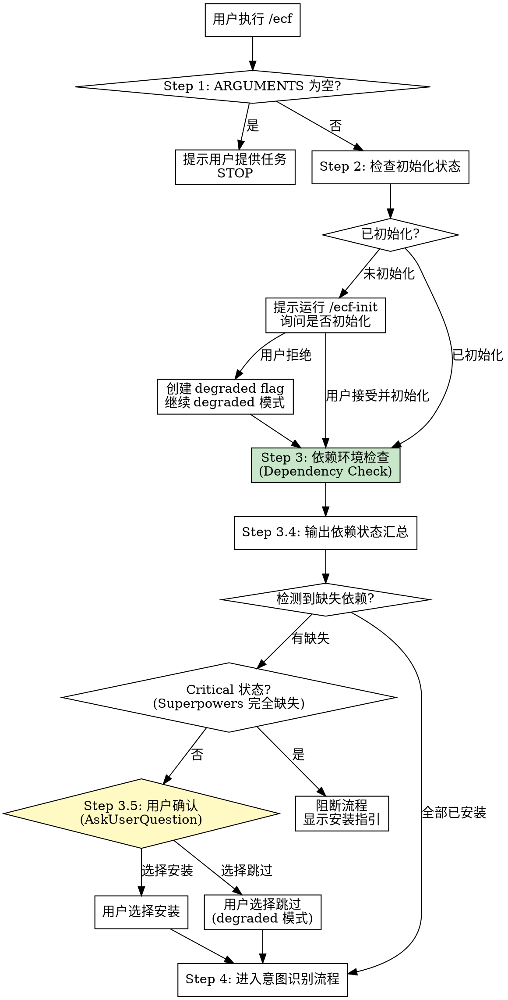

# EasyCodingFlow 编排

## Overview

统一的 Agent 协作编排 skill，整合 Superpowers、OpenSpec、Compound Engineering。

**Core principle**: 每个请求必须先经过意图识别，再路由到工作流。

## Entry Point

User provided arguments: `$ARGUMENTS`

### Pre-flight Check (REQUIRED FIRST)

**⚠️ 必须在任何工作流之前执行此检查序列。**

**Violating the letter of this process is violating the spirit of ecf.**



#### Step 1: Empty Arguments Check

If `$ARGUMENTS` is empty or whitespace-only:

```
🔍 Agent-Teams 帮手

请提供具体任务，例如：
• bug fix [问题描述] - 修复某个问题
• 开发新功能 [功能描述] - 实现某个功能
• review [范围] - 代码审查
• 重构 [模块] - 代码重构
• 文档更新 - 更新文档
• 测试补齐 - 补充测试用例

输入 /ecf-init 可初始化项目结构。
```

**STOP here** - wait for user input. Do NOT proceed to intent recognition.

**No exceptions:**
- Don't try to guess what user wants
- Don't proceed with empty task
- Don't invoke other skills without user input

#### Step 2: Initialization Check

Check required directories exist:
- `docs/solutions/` (knowledge base) - Required
- `.claude/ecf_config.yaml` (project config) - Required

**If missing required items:**
```
⚠️ 项目未初始化
缺失: [list of missing items]

建议运行: /ecf-init
```

Ask user: "是否现在初始化项目?"
- User says "yes" → Invoke `ecf-init` skill
- User says "no" → Create `.claude/.ecf-degraded.flag`, proceed with degraded mode

**Degraded Mode Behavior:**
- Knowledge retrieval disabled
- OpenSpec storage disabled
- Intent recognition continues normally
- Warning shown: `⚠️ 知识检索功能不可用`

#### Step 3: Dependency Environment Check

**⚠️ 在调用任何外部 skills 前必须检查所有依赖环境。**

检查三大依赖：
1. **OpenSpec Skills**: 项目级 `.claude/skills/openspec-*`
2. **Compound Engineering Plugin**: `~/.claude/plugins/cache/compound-engineering-plugin/`
3. **Superpowers@frad-dotclaude**: `CLAUDE_PLUGIN_ROOT` + `setup-superpower-loop.sh`

**快速检测脚本**:

```bash
# OpenSpec Skills
OPENSPEC_SKILLS=("openspec-explore" "openspec-propose" "openspec-apply-change" "openspec-archive-change")
MISSING_OPSX=()
for skill in "${OPENSPEC_SKILLS[@]}"; do
    [[ ! -d ".claude/skills/${skill}" ]] && MISSING_OPSX+=("$skill")
done

# Compound Engineering
CE_INSTALLED=$(ls ~/.claude/plugins/cache/compound-engineering-plugin/ 2>/dev/null | grep -q . && echo "✅" || echo "⚠️")

# Superpowers
export CLAUDE_PLUGIN_ROOT="${CLAUDE_PLUGIN_ROOT:-$(ls -d ~/.claude/plugins/marketplaces/frad-dotclaude/superpowers 2>/dev/null || ls -d ~/.claude/plugins/cache/frad-dotclaude/superpowers/*/ 2>/dev/null | head -1 || echo "")}"
SP_STATUS="⚠️"
[[ -n "$CLAUDE_PLUGIN_ROOT" && -f "$CLAUDE_PLUGIN_ROOT/scripts/setup-superpower-loop.sh" ]] && SP_STATUS="✅"
```

**用户确认 Matrix**:

| 依赖缺失类型 | 状态级别 | 用户选项 |
|--------------|----------|----------|
| OpenSpec Skills | Warning | 安装 / 跳过 (Brainstorming 替代) |
| Compound Engineering | Warning | 安装 / 跳过 (直接写入 docs/solutions/) |
| Superpowers (frad 未安装) | Warning | 安装 / 跳过 (官方版本 fallback) |
| Superpowers (完全未安装) | **Critical** | 阻断流程，必须安装 |

**会话缓存**: 用户选择存储在内存变量 `_AGENT_TEAMS_DEP_CONFIRMED`，避免同一会话重复询问。

详细检测流程见 [dependency-check.md](references/dependency-check.md)。

##### Dependency Status Summary

```
🔍 Dependency Check Summary
━━━━━━━━━━━━━━━━━━━━━━━━━━━━━
OpenSpec Skills:      [状态] [如有缺失显示列表]
Compound Engineering: [状态]
Superpowers:          [状态]
━━━━━━━━━━━━━━━━━━━━━━━━━━━━━
[如有 Critical 问题，显示建议操作]
```

##### Step 3.5: Dependency Confirmation

**⚠️ 检测到缺失依赖时，必须向用户确认处理方式。**

**会话缓存检查**: 如果 `_AGENT_TEAMS_DEP_CONFIRMED` 已存在，跳过此步骤。

**Critical 状态阻断**:
- 如果 Superpowers 完全缺失（`CLAUDE_PLUGIN_ROOT` 为空），阻断流程并显示安装指引
- 其他缺失类型为 Warning，允许用户选择跳过

**用户确认格式** (使用 AskUserQuestion tool):

```json
{
  "questions": [
    {
      "header": "缺失依赖",
      "question": "检测到以下依赖缺失，如何处理？",
      "multiSelect": true,
      "options": [
        {
          "label": "安装 OpenSpec Skills (推荐)",
          "description": "安装 openspec-* 技能，获得完整 Contract Layer 功能"
        },
        {
          "label": "安装 Compound Engineering (推荐)",
          "description": "安装 CE 插件，获得知识沉淀自动化功能"
        },
        {
          "label": "安装 Superpowers@frad (推荐)",
          "description": "安装 frad 版本 Superpowers，获得完整执行层功能"
        },
        {
          "label": "跳过全部，使用 degraded 模式",
          "description": "不安装任何依赖，功能将受限（OpenSpec 用 Brainstorming 替代，CE 直接写入 docs/solutions/）"
        }
      ]
    }
  ]
}
```

**用户选择后**:
- 选择"安装" → 显示对应安装命令，设置 `_AGENT_TEAMS_DEP_CONFIRMED=<type>:install`
- 选择"跳过" → 设置 `_AGENT_TEAMS_DEP_CONFIRMED=<type>:skip`，继续 degraded 模式
- 选择"跳过全部" → 设置 `_AGENT_TEAMS_DEP_CONFIRMED=all:skip`

**Degraded 模式警告**:
```
⚠️ Degraded 模式运行
已跳过安装的依赖: [列表]
功能限制: [说明 fallback 策略]
```

#### Step 4: Proceed to Intent Recognition

**Only after pre-flight checks (Steps 1-3) pass**, proceed to Intent Recognition Flow below.

**契约层入口路由决策表**:

| 场景类型 | 契约层入口 | 说明 |
|----------|------------|------|
| new_feature | `/opsx:propose` | 需要 OpenSpec 变更管理 |
| skill_development | `/opsx:propose` | 需要 OpenSpec 变更管理 |
| incremental | `/opsx:propose` | 需要 OpenSpec 变更管理 |
| refactor | `Skill("superpowers:brainstorming")` | **不需要 OpenSpec**，直接 brainstorming |
| bug_fix | **跳过契约层** | 直接执行层 |
| code_review | **跳过契约层** | 直接执行层 |
| test_coverage | **跳过契约层** | 直接执行层 |
| documentation | **跳过契约层** | 直接执行 |

**关键区分**:
- `/opsx:propose` 用于需要变更管理的场景（后续需要 `/opsx:archive`）
- `brainstorming` 用于需要规划但不需要变更管理的场景
- bug_fix/code_review 等跳过契约层，直接进入执行层

## Red Flags - Pre-flight

If you find yourself thinking:
- "I'll skip the empty check and proceed anyway"
- "User probably wants to do X, let me start"
- "Dependency check is optional - I'll skip it"

**STOP. These are violations.** Return to Pre-flight Check Step 1.

## When to Use

| 场景 | 关键词 |
|------|--------|
| 新需求开发 | 开发、新功能、实现、创建 |
| Bug修复 | bug、报错、失败、修复 |
| 代码重构 | 重构、优化结构 |
| Code Review | review、审查 |
| 文档更新 | 文档、readme |
| 用例补齐 | 测试、用例、coverage |
| 知识检索 | 之前、类似、历史 |

## Architecture

```
Layer 0: 编排层 (Intent → Route → Team → Monitor)
Layer 1: 规范契约层 (OpenSpec / Brainstorming)
Layer 2: 执行层 (Writing-Plans → Executing-Plans + EasyCodingFlow)
Layer 2.5: 验证层 (Consistency-Verification + Architecture-Doc Update)
Layer 3: 知识沉淀层 (Compound)
```

**Order**: 必须按层顺序执行。Bug修复可跳过 Layer 1。

**并发执行**: Layer 2 使用 `superpowers:agent-team-driven-development` 实现真正的并发。

## Parallel Execution

**⚠️ 执行层必须使用并发能力提升效率。**

| 任务数量 | 执行模式 | Agent 通信 |
|----------|----------|------------|
| >6 独立任务 | Agent Team | ✅ 可互发消息 |
| ≤6 独立任务 | Subagent | ❌ 仅返回调用者 |
| 1 任务 | Linear | ❌ 无 |
| 配对 | Red-Green Pair | ✅ 配对内顺序 |

**必加载 Skills** (仅当使用 team 模式时):
1. `superpowers:agent-team-driven-development`
2. `superpowers:behavior-driven-development`

**执行技能**: `/ecf-execute [plan-path]`

详细流程见 [parallel-execution.md](references/parallel-execution.md)。

## Workflow

核心工作流表格。**完整定义见 [workflow-templates.md](references/workflow-templates.md)**。

| Scenario | Workflow |
|----------|----------|
| 新需求开发 | `/opsx:propose` → `brainstorming` → `writing-plans` → **`ecf-execute`** → **`ecf-verify`** → **`/opsx:archive`** → `ce:compound` |
| Bug修复 | `systematic-debugging` → fix → **`ecf-verify`** → `ce:compound` |
| 代码重构 | `brainstorming` → `writing-plans` → **`ecf-execute`** → **`ecf-verify`** → `ce:compound` |
| Code Review | **`ce-review`** → `ce:compound` |
| Skills开发 | `/opsx:propose` → **`skill-creator`** → **`skill-quality-verification`** → **`/opsx:archive`** → `ce:compound` |

**关键说明**:
- **Archive 步骤**: OpenSpec 发起的变更必须调用 `/opsx:archive` 完成闭环
- **Skills开发特例**: 执行层使用 `skill-creator`，验证层使用 `skill-quality-verification`
- **执行入口**: 必须使用 `/ecf-execute`（强制并发）
- **⚠️ ce:compound 不可跳过**: 所有工作流最后一步必须调用 `ce:compound`，跳过会导致知识无法沉淀

**工作流完成检查**: 使用 [workflow-completion-checklist.md](references/workflow-completion-checklist.md) 检查各步骤状态，防止遗漏 ce:compound。

**REQUIRED**: OpenSpec 产物需转换。See [converter/SKILL.md](references/converter/SKILL.md).

## After Contract Layer Complete (CRITICAL)

**⚠️ 契约层完成后，必须根据场景类型路由，禁止直接执行 /opsx:apply。**

OpenSpec 工具（/opsx:propose）返回通用提示 "Run /opsx:apply..."，
**但 ecf 项目禁止使用 /opsx:apply**，必须使用正确的执行入口。

### 路由决策表

| 意图识别结果 | 下一步（执行层入口） | 禁止 |
|--------------|----------------------|------|
| skill_development | `Skill("skill-creator")` | `/opsx:apply` |
| new_feature | `/ecf-execute` | `/opsx:apply` |
| refactor | `/ecf-execute` | `/opsx:apply` |
| incremental | `/ecf-execute` | `/opsx:apply` |
| bug_fix | `Skill("systematic-debugging")` | `/opsx:apply` |
| code_review | `Skill("ce-review")` | `/opsx:apply` |

### Red Flags - After Contract Layer (CRITICAL)

- 契约层完成后调用 `/opsx:apply` — **ecf 项目禁止使用**
- 看到 OpenSpec 提示就执行 `/opsx:apply` — **必须检查场景路由**
- 使用 `superpowers:executing-plans` — **必须使用 `/ecf-execute`**

**遇到以上**: 停止，执行路由检查，使用正确的执行入口。

### 为什么禁止 /opsx:apply

1. `/opsx:apply` 可能顺序执行，不利用并发优势
2. `/ecf-execute` 强制加载 agent-team-driven-development，实现真正并发
3. ecf 项目要求执行层统一入口，确保一致性和效率

## Knowledge Layer (Layer 3)

**⚠️ 每个工作流完成后必须触发知识沉淀。**

```bash
# 快速检查 CE 插件
if ls ~/.claude/plugins/cache/compound-engineering-plugin/ 2>/dev/null | grep -q .; then
    Skill("ce:compound")  # CE 处理完整流程
else
    # Degraded 模式: 直接写入 docs/solutions/
fi
```

**No exceptions:**
- 不要跳过 CE 插件检查
- Skill 失败时必须 fallback 到 Degraded 模式
- 不要跳过知识沉淀步骤

详细流程见 [knowledge-writing.md](references/knowledge-writing.md)。

## Writing-Plans Phase 6 监控

**⚠️ 必须监控 writing-plans 完成后的输出。**

如果输出引导到 `/superpowers:executing-plans`，自动纠正：

```
⚠️ ecf 项目强制使用并发执行入口
正确执行入口: /ecf-execute [plan-path]
正在自动切换到并发执行模式...
```

## Team Building

| Complexity | Agents | Model |
|------------|--------|-------|
| simple | 1 | haiku |
| medium | 2-3 | sonnet |
| complex | 4-6 | mixed |

## Red Flags - STOP

- 直接编码未意图识别
- 新需求跳过 brainstorming
- Bug修复不用 systematic-debugging
- 工作流完成但未调用 ce:compound
- 调用 superpowers skill 时卡住但未检查 CLAUDE_PLUGIN_ROOT
- **>6 任务仍使用 linear 或 subagent 模式（应使用 team）**
- **≤6 独立任务使用 team 模式（应使用 subagent）**
- **未调用 ecf-execute 作为执行入口**
- **跳过用户确认直接 fallback（必须先询问用户）**
- **Critical 状态未阻断（Superpowers 完全缺失必须阻断）**

**遇到以上**: 从相应步骤重新开始，遵循正确流程。

## References

- [intent-keywords.md](references/intent-keywords.md) - 关键词映射
- [workflow-templates.md](references/workflow-templates.md) - 工作流模板
- [workflow-completion-checklist.md](references/workflow-completion-checklist.md) - 工作流完成检查清单
- [parallel-execution.md](references/parallel-execution.md) - 并发执行策略
- [dependency-check.md](references/dependency-check.md) - 依赖检查完整参考
- [superpowers-environment-check.md](references/superpowers-environment-check.md) - Superpowers 环境检查
- [intent-recognition.md](references/intent-recognition.md) - 意图识别流程
- [knowledge-writing.md](references/knowledge-writing.md) - 知识沉淀流程
- [converter/SKILL.md](references/converter/SKILL.md) - 产物转换

## Skills

| 技能 | 调用方式 | 功能 |
|------|----------|------|
| ecf-init | `/ecf-init` | 初始化项目结构 |
| ecf-execute | `/ecf-execute` | 并发执行计划 |
| ecf-verify | `/ecf-verify` | 一致性验证 |