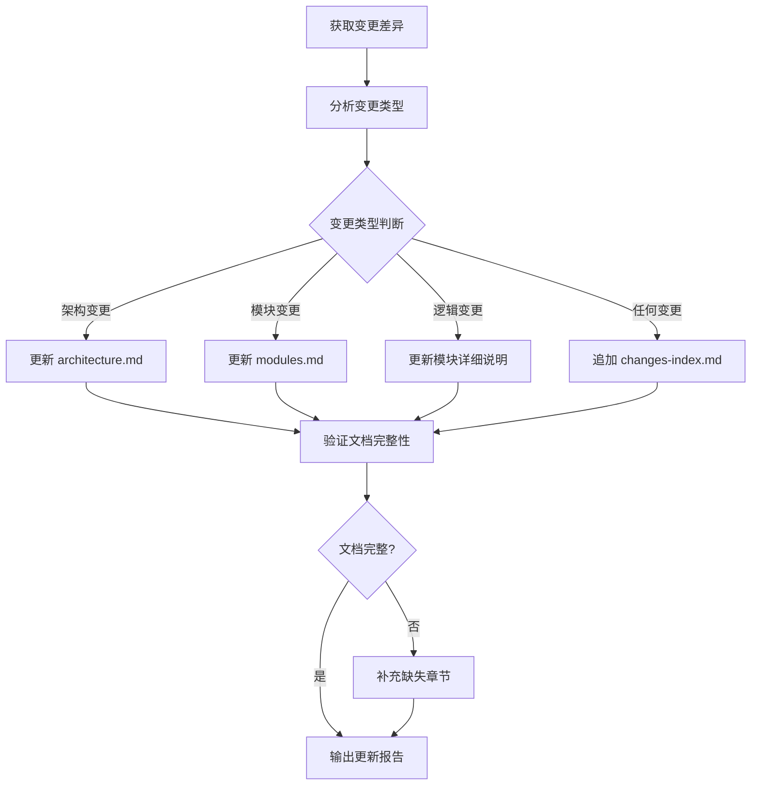

# Architecture-Doc Analyzer Template

总文档一致性分析器模板，用于 Consistency-Verification 层 Phase 2。

## 分析器职责

扫描变更差异，分析变更类型，更新 docs/openspec/architectures/ 目录下的三文件。

## 分析流程



---

## 变更类型判断规则

| 变更信号 | 判断条件 | 触发更新 | 更新目标章节 |
|---------|---------|---------|-------------|
| 技术栈变更 | package.json/Gemfile/pom.xml 修改 | architecture.md | 技术栈表、架构图 |
| 新增依赖 | import 新库、require 新模块 | architecture.md | 依赖图 |
| 新增目录 | 新建 src/xxx/ 目录 | modules.md | 模块清单、依赖图 |
| 删除目录 | 删除目录 | modules.md | 模块状态改为 archived |
| 核心入口变更 | 主函数、API 路由、CLI 命令修改 | modules.md | 模块入口章节 |
| 数据流变更 | 数据处理逻辑重构 | architecture.md | 数据流图 |
| 错误处理变更 | 异常捕获机制修改 | architecture.md | 设计决策表 |
| 接口契约变更 | 公开函数签名修改 | modules.md | 接口契约章节 |
| 任何变更 | Git diff 显示文件变更 | changes-index.md | 变更记录追加条目 |

---

## Analyzer Prompt Template

```markdown
你是 Architecture-Doc 一致性分析器。

输入:
- git diff: [当前变更差异]
- docs/openspec/architectures/architecture.md: [现有内容]
- docs/openspec/architectures/modules.md: [现有内容]
- docs/openspec/architectures/changes-index.md: [现有内容]

分析任务:
1. 解析 git diff 获取变更文件列表
2. 分析变更类型：
   - 技术栈文件变更 → 技术栈变更
   - 新建/删除目录 → 模块变更
   - 核心入口文件变更 → 接口契约变更
   - 数据处理文件变更 → 数据流变更
3. 根据变更类型确定需要更新的文档和章节
4. 提取变更内容关键信息（新接口签名、新模块职责等）
5. 验证文档完整性

输出:
- 变更类型列表（每项包含: 类型、文件、影响范围）
- 更新内容建议（每项包含: 目标文件、章节、建议内容）
- 变更索引条目（日期、模块、变更类型、影响范围、链接）

每个输出项必须包含:
- 变更来源 (git diff 文件路径)
- 影响等级 (高/中/低)
- 更新建议 (具体章节和内容)
```

---

## 输出格式

```
## 变更分析结果

### 变更类型列表
| 类型 | 文件 | 影响范围 | 等级 |
|------|------|---------|------|
| 技术栈变更 | package.json | 依赖管理 | 高 |
| 新增模块 | src/new-module/ | 功能扩展 | 中 |

### 更新建议
**architecture.md 技术栈表**
- 新增依赖: lodash@4.17.21
- 更新理由: 添加数组处理工具库

**modules.md 模块清单**
- 新增条目: new-module | 数据处理 | active | -
- 依赖图: new-module → core

### 变更索引条目
| 日期 | 模块 | 变更类型 | 影响范围 | 设计文档链接 |
|------|------|---------|---------|-------------|
| 2026-04-19 | new-module | 新增 | 数据处理功能 | [链接](...) |

## 文档完整性检查
- architecture.md: ✅ 完整
- modules.md: ✅ 完整
- changes-index.md: ✅ 完整
```

---

## 文档完整性验证规则

### architecture.md 必要章节

- 概述
- 技术栈
- 架构图
- 数据流
- 核心设计决策
- 最后更新

### modules.md 必要章节

- 模块清单
- 模块依赖关系图
- 模块详细说明

### changes-index.md 必要章节

- 变更记录
- 统计

---

## 错误处理

| 异常情况 | 处理方式 |
|---------|---------|
| architectures 目录不存在 | 调用 ecf-init 创建 |
| 文档格式损坏 | 重建空白模板 |
| 变更内容无法提取 | 手动提示用户输入 |