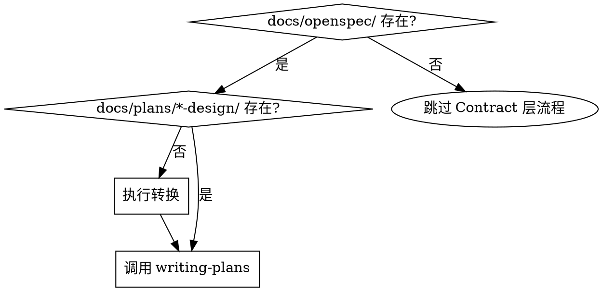

# OpenSpec to Superpowers Converter

## Overview

**Core principle**: OpenSpec 产物路径和格式与 superpowers 不兼容，必须转换才能继续。

```
docs/openspec/proposals/YYYY-MM-DD-topic/
    ├── proposal.md  →  docs/plans/YYYY-MM-DD-topic-design/_index.md (Context)
    ├── spec.md      →  docs/plans/YYYY-MM-DD-topic-design/bdd-specs.md
    └── design.md    →  docs/plans/YYYY-MM-DD-topic-design/architecture.md
```

## When to Use

**Triggering conditions**:
- Contract 层完成，`docs/openspec/proposals/` 有产物
- Execution 层即将启动，需要调用 `writing-plans`
- `docs/plans/*-design/` 目录不存在或不匹配

**NOT needed when**:
- `docs/plans/*-design/` 已存在且包含 `.conversion-metadata.yaml`
- 使用 `superpowers:brainstorming` 直接生成设计（已兼容）
- 只做 Bug 修复（跳过 Contract 层）

**Multiple proposals handling**:
- 多个 `docs/openspec/proposals/YYYY-MM-DD-*/` 存在时，选择最新的（按日期排序）
- 或让用户指定要转换的 proposal

## Conversion Steps

### Step 1: Detect Source Path

```bash
# 找到最新的 OpenSpec proposal
ls docs/openspec/proposals/ | sort -r | head -1
# 输出: 2026-04-15-topic/
```

### Step 2: Create Target Directory

```bash
# 基于源路径生成目标路径
source="docs/openspec/proposals/2026-04-15-topic/"
target="docs/plans/2026-04-15-topic-design/"
mkdir -p "$target"
```

### Step 3: Convert Files

| Source File | Target File | Extract Content |
|-------------|-------------|-----------------|
| `proposal.md` | `_index.md` | 动机→Context.动机与背景, 约束→Requirements.约束条件, 成功标准→Requirements.成功标准 |
| `spec.md` | `bdd-specs.md` | 功能定义→Feature, 动作→Scenario.When/Then |
| `design.md` | `architecture.md` | 架构设计→系统架构概览, 模块→组件表格, 数据流→数据流架构 |

### Step 4: Write Metadata

```yaml
# 写入 .conversion-metadata.yaml 到目标目录
conversion_metadata:
  source_path: "[源路径]"
  target_path: "[目标路径]"
  converted_at: "[时间戳]"
```

## Quick Reference

| Check | Action |
|-------|--------|
| `docs/openspec/` exists? | Yes → Check conversion needed |
| `docs/plans/*-design/` exists? | No → Run conversion |
| `writing-plans` called? | Verify input path is `docs/plans/*-design/` |

## Common Mistakes

| Mistake | Fix |
|---------|-----|
| 直接调用 `writing-plans(docs/openspec/...)` | 先转换到 `docs/plans/*-design/` |
| 假设"读取内容传递"可行 | writing-plans 需要路径格式，不是内容 |
| 转换后不验证格式 | 检查 `_index.md` 有 Context 部分 |
| 缺失内容时报错停止 | 使用默认模板填充，记录警告 |

## Red Flags - STOP

- 直接使用 `docs/openspec/` 路径调用 `writing-plans`
- "我可以直接读取 proposal.md 内容"
- 假设技能会自动处理路径差异
- 跳过转换"因为内容看起来类似"
- 假设"已转换"但未检查元数据文件
- 多个 proposal 时未确认用户选择

**遇到以上情况**: 停止，执行转换步骤。

## Rationalization Table

| Excuse | Reality |
|--------|---------|
| "传递内容上下文给技能" | writing-plans 搜索 `docs/plans/*-design/`，不接受内容参数 |
| "路径看起来正确" | OpenSpec 路径 ≠ superpowers 路径，格式完全不同 |
| "用户可以选择目录" | Agent 应主动转换，不是被动询问 |
| "内容格式差不多" | 文件名和结构完全不同，必须转换 |
| "已经转换过了" | 检查 `.conversion-metadata.yaml` 是否存在，无元数据=未转换 |
| "转换太慢，直接调用" | 跳过转换会导致 writing-plans 找不到输入，流程失败 |

## Implementation

转换由 Orchestrator 自动触发（隐式转换）。Agent 调用 `writing-plans` 前检查:

