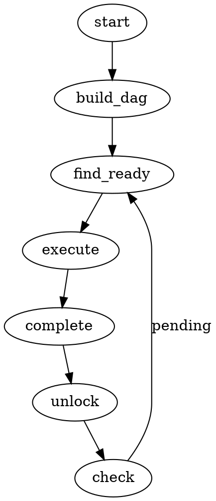

# DAG Scheduling

## Task Dependency Model

```yaml
Task:
  status: "pending" | "blocked" | "ready" | "in_progress" | "completed"
  blockedBy: ["task-id-1"]  # Prerequisites
  blocks: ["task-id-3"]     # Depends on this
```

## Execution Algorithm



## State Transitions

```
pending → ready (blockedBy all completed)
ready → in_progress (start)
in_progress → completed (pass)
in_progress → blocked (fail)
```

## Parallel Strategy

| Status | Action |
|--------|--------|
| ready, no deps | Parallel start |
| blocked | Wait |
| ready, same-layer deps | Sequential |

**Limit**: `max_parallel_agents: 5`

## Status Panel

```
📋 任务状态面板
━━━━━━━━━━━━━━━━━━━━
Task-1: ✅ completed
Task-2: 🔄 in_progress
Task-3: ⏳ blocked
━━━━━━━━━━━━━━━━━━━━
并行执行中: [N] 个 Agent
```

## Red Flags

- Execute without checking deps
- Force-start blocked tasks
- No downstream unlock
- Exceed parallel limit