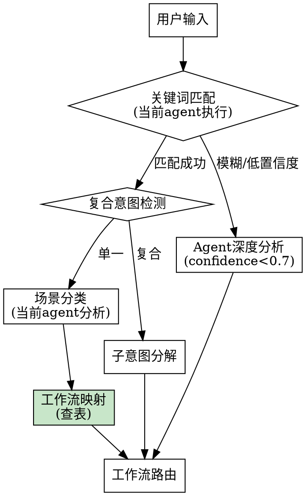

# Intent Recognition Flow

## Overview

意图识别由**当前 Claude Code agent 直接执行**，不需要额外的 LLM API 调用。Skill 内容加载到 agent 上下文后，agent 原生具备分析用户意图的能力。

## Process



**关键步骤**:
1. **关键词匹配** - 基于关键词快速识别场景类型
2. **场景分类** - 确定 new_feature/refactor/bug_fix 等
3. **工作流映射** - 查表获取标准工作流（见下方映射表）
4. **路由决策** - 根据场景类型决定契约层入口

## Important: No External API Calls

**关键原则**: 意图识别始终由当前 Claude session 执行。

- **confidence >= 0.7**: 关键词匹配直接路由，无需额外分析
- **confidence < 0.7**: 当前 agent 基于上下文深度分析意图
- **任何时候**: 不要发起独立的 LLM API 调用或 Agent tool 调用来做意图识别

当前 Claude Code session 本身就是 LLM agent，skill 加载后 agent 已具备完整的意图理解能力。

## Compound Intent Detection

**Trigger words**: "并"、"且"、"然后"、"接着"

**Process**:
1. Split into sub-intents
2. Sort by layer priority: contract → execution
3. Execute sub-intents sequentially
4. Pass context between sub-intents

**Examples**:
| Input | Sub-intents | Order |
|-------|-------------|-------|
| "设计并实现支付系统" | design → implement | brainstorming → executing |
| "重构用户模块并添加测试" | refactor → test | refactor workflow → BDD |

## Keywords Reference

See [intent-keywords.md](./intent-keywords.md) for full keyword mapping.

## Workflow Mapping Table

> **权威源声明**: 工作流定义来自 [workflow-templates.md](./workflow-templates.md)，此表为快速参考。

| 场景类型 | 标准工作流 |
|----------|------------|
| new_feature | `/opsx:propose` → `brainstorming` → `writing-plans` → `ecf-execute` → `ecf-verify` → `/opsx:archive` → `ce:compound` |
| skill_development | `/opsx:propose` → `skill-creator` → `skill-quality-verification` → `/opsx:archive` → `ce:compound` |
| refactor | `brainstorming` → `writing-plans` → `ecf-execute` → `ecf-verify` → `ce:compound` |
| bug_fix | `systematic-debugging` → `fix` → `ecf-verify` → `ce:compound` |
| code_review | `ce-review` → `ce:compound` |
| incremental | `/opsx:propose` → `executing-plans` → `ecf-verify` → `/opsx:archive` → `ce:compound` |
| test_coverage | `BDD` → `ecf-verify` → `ce:compound` |
| documentation | `direct execution` |

**使用方式**: 场景分类完成后，查此表获取标准工作流，填入输出模板。

## Output Format Template

意图识别完成后，必须输出以下格式：

```
意图识别
任务分析: <task description>
  - 关键词: <extracted keywords>
  - 场景类型: <type> (<description>)
  - 标准工作流: <workflow steps from mapping table>

路由决策: <routing reason>
  → 契约层入口: <entry point>
```

**字段说明**:
- **任务分析**: 用户任务的简要描述
- **关键词**: 从任务中提取的关键词（逗号分隔）
- **场景类型**: 识别的场景类型 + 中文描述
- **标准工作流**: 从映射表获取的完整工作流（使用 `→` 连接）
- **路由决策**: 路由原因说明
- **契约层入口**: 下一步执行的入口（skill 或命令）

**示例输出**:

```
意图识别
任务分析: 重构 parallel_state.py 的 initialize_model_parallel_wrapper 方法
  - 关键词: 重构、抽取公共逻辑、高内聚低耦合
  - 场景类型: refactor (代码重构)
  - 标准工作流: brainstorming → writing-plans → ecf-execute → ecf-verify → ce:compound

路由决策: 根据场景路由表，refactor 不需要 OpenSpec 变更管理
  → 契约层入口: superpowers:brainstorming
```

```
意图识别
任务分析: 优化 ecf skill 的意图识别输出格式，添加标准工作流信息
  - 关键词: 优化、技能、SKILL.md、日志格式
  - 场景类型: skill_development (技能开发)
  - 标准工作流: /opsx:propose → skill-creator → skill-quality-verification → /opsx:archive → ce:compound

路由决策: skill_development 需要完整变更管理流程
  → 契约层入口: /opsx:propose
```