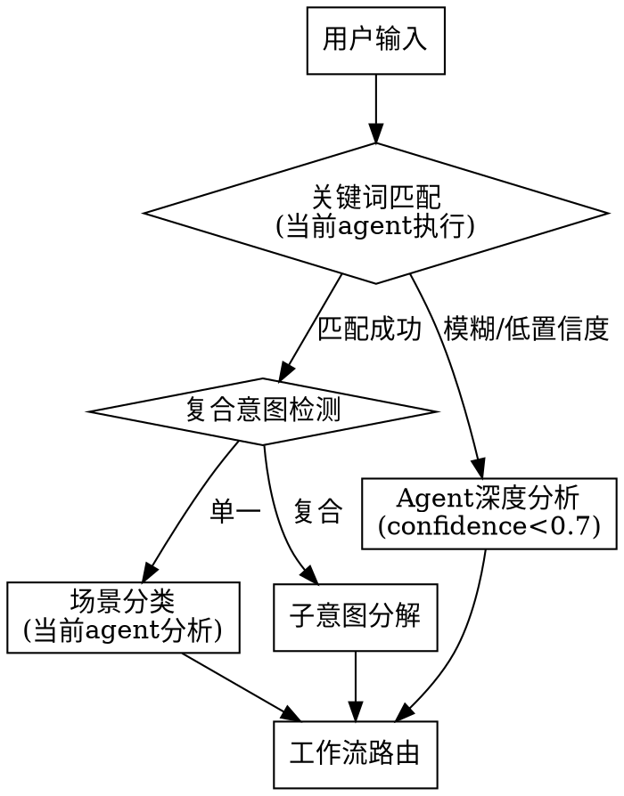

# Intent Recognition Flow

## Overview

意图识别由**当前 Claude Code agent 直接执行**，不需要额外的 LLM API 调用。Skill 内容加载到 agent 上下文后，agent 原生具备分析用户意图的能力。

## Process

## Important: No External API Calls

**关键原则**: 意图识别始终由当前 Claude session 执行。

- **confidence >= 0.7**: 关键词匹配直接路由，无需额外分析
- **confidence < 0.7**: 当前 agent 基于上下文深度分析意图
- **任何时候**: 不要发起独立的 LLM API 调用或 Agent tool 调用来做意图识别

当前 Claude Code session 本身就是 LLM agent，skill 加载后 agent 已具备完整的意图理解能力。

## Compound Intent Detection

**Trigger words**: "并"、"且"、"然后"、"接着"

**Process**:
1. Split into sub-intents
2. Sort by layer priority: contract → execution
3. Execute sub-intents sequentially
4. Pass context between sub-intents

**Examples**:
| Input | Sub-intents | Order |
|-------|-------------|-------|
| "设计并实现支付系统" | design → implement | brainstorming → executing |
| "重构用户模块并添加测试" | refactor → test | refactor workflow → BDD |

## Keywords Reference

See [intent-keywords.md](./intent-keywords.md) for full keyword mapping.