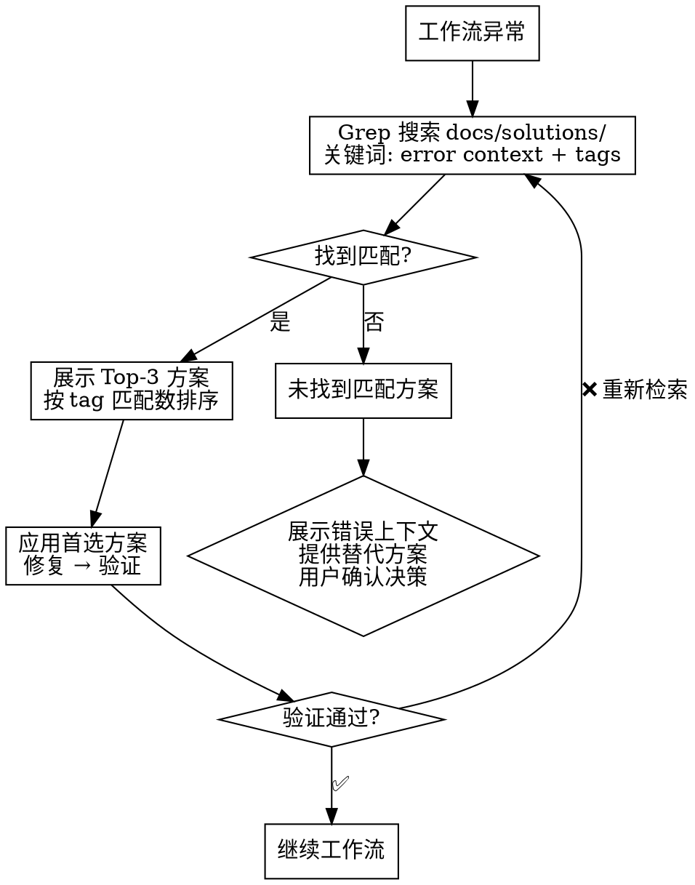

# Knowledge Retrieval

## Trigger Keywords

| Keyword | Example | Target |
|---------|---------|--------|
| 之前/曾经 | "之前怎么处理过认证问题" | docs/solutions/ |
| 类似 | "有没有类似的重构经验" | Similar solutions |
| 历史/经验 | "查看历史的bug修复经验" | Bug solutions |
| 怎么处理 | "这种问题怎么处理" | Problem matching |

## Search Process


**Implementation**:
- Search: `docs/solutions/*.md`
- Method: Grep keywords → relevance sort → top 3

## Output Format

```
📚 知识库检索结果
━━━━━━━━━━━━━━━━━━━━
查询: [Query]
找到 [N] 个相关方案:

1. [Title] ([Filename])
   概要: [Summary]
━━━━━━━━━━━━━━━━━━━━
选择方案编号应用，或输入 'n' 不应用
```

## Knowledge Base Structure

```
docs/solutions/
├── YYYY-MM-DD-topic-solution.md
├── auth-system-solution.md
└── ...
```

## 自动异常场景检索 (Automatic Exception Scenario Retrieval)

工作流执行遇到异常时自动触发的知识检索，无需用户明确要求。

### Trigger Conditions

| 触发场景 | 触发条件 | 触发时机 |
|----------|----------|----------|
| Task 执行失败 | subagent 返回非零退出码或 error 输出 | ecf-execute 验证门控 |
| Skill 调用异常 | skill 调用未返回预期结果或报错 | 编排层工作流步骤 |
| 验证不通过 | ecf-verify 发现不一致项 | 验证层 Phase 1 完成后 |
| 依赖安装失败 | 依赖环境检测未通过 | Pre-flight Step 3 |

### Retrieval Process



### Rules

1. **Tag 优先匹配**: 结果按 frontmatter tags 匹配数排序，tags 匹配优先于正文关键词匹配
2. **空知识库处理**: `docs/solutions/` 为空或无匹配时直接跳过，不阻塞工作流
3. **自动应用条件**: Top-1 匹配且 tags 匹配 >=1 时自动应用，应用后必须验证
4. **多选择处理**: 多个匹配时展示 Top-3，用户选择后执行
5. **修复验证**: 应用修复后必须通过验证门控，失败则重新检索或升级

### Output Format

异常场景下的检索结果使用以下输出模板：

```
📚 知识检索 (异常处理)
━━━━━━━━━━━━━━━━━━━━━━━━━━━━━
异常上下文: [error description]
检索目录: docs/solutions/
匹配结果: [N] 个相关方案

Top 方案:
1. [Title] (tag 匹配: N) - [filename]
   概要: [1-2 行摘要]
   → [自动应用 / 待用户选择]

━━━━━━━━━━━━━━━━━━━━━━━━━━━━━
[应用结果: ✅ 修复成功 / ⚠️ 修复失败，升级处理]
```

### Integration Points

| 调用方 | 调用时机 | 预期行为 |
|--------|----------|----------|
| ecf SKILL.md 编排层 | 工作流步骤异常 | 检索后自动修复或升级 |
| ecf-execute 验证门控 | Task FAIL 时 | 检索后重试 |
| ecf-verify 验证层 | 发现不一致 | 检索后推荐修复方案 |

## Red Flags

- No retrieval when user asks about history
- Results not sorted by relevance
- No summary presentation
- No apply option
- **工作流异常时跳过知识检索直接报错**
- **匹配到解决方案但未经验证门控**
- **知识库为空时阻塞工作流（应静默跳过）**