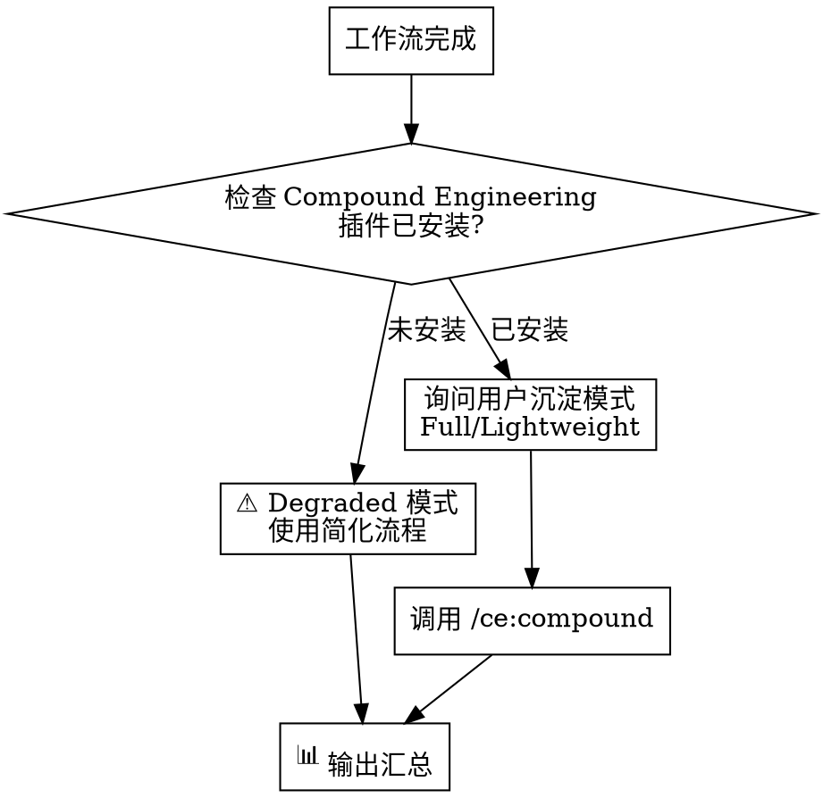

# Knowledge Layer Integration (知识沉淀层集成)

## Overview

知识沉淀层通过调用 **Compound Engineering 框架** 的 `/ce:compound` skill 实现。

**Core principle**: 使用已安装的 Compound Engineering 框架，不重复实现知识沉淀逻辑。

## Trigger Timing

| 工作流 | 触发时机 | CE 操作类型 |
|--------|----------|-------------|
| bug_fix | systematic-debugging 完成后 | Keep (bug track) |
| new_feature | executing-plans 完成后 | Keep (knowledge track) |
| refactor | executing-plans 完成后 | Consolidate |
| code_review | receiving-code-review 完成后 | Update |
| test_coverage | BDD 完成后 | Update |

## Process



## Step 1: Check Compound Engineering Plugin

```bash
# 检查 Compound Engineering 插件是否安装
ls ~/.claude/plugins/cache/compound-engineering-plugin/ 2>/dev/null
```

**If installed**: 调用 `/ce:compound` skill

**If not installed**: 输出 `⚠️ Compound Engineering 未安装，使用简化流程`

## Step 2: Invoke Compound Engineering

使用 Skill tool 调用 `/ce:compound`:

```
Skill("ce:compound")
```

Compound Engineering 会：
1. 询问用户选择 Full 或 Lightweight 模式
2. 分析上下文并提取问题/解决方案
3. 写入 `docs/solutions/[category]/[filename].md`
4. 输出文档路径和后续选项

### Full Mode (推荐)

完整的知识沉淀流程：
- Context Analyzer: 分析问题类型和 track
- Solution Extractor: 提取解决方案
- Related Docs Finder: 搜索相关文档
- Session Historian: 搜索历史 session (可选)
- 输出到 `docs/solutions/[category]/`

### Lightweight Mode

简化的单次流程：
- 当前 agent 直接提取并写入
- 无 subagent 并行
- 输出到 `docs/solutions/[category]/`

## Step 3: Output Summary

在知识沉淀完成后，输出 📊 汇总：

```
📊 执行汇总
━━━━━━━━━━━━━━━━━━━━
工作流: [workflow_name]
阶段:
  ✅ 意图识别
  ✅ [执行层步骤]
  ✅ 知识沉淀 (ce:compound)
━━━━━━━━━━━━━━━━━━━━
知识库: docs/solutions/[category]/[filename].md
━━━━━━━━━━━━━━━━━━━━
结论: [总结]
```

## CE Category Mapping

Compound Engineering 的 category 映射：

| 问题类型 | Category 目录 |
|----------|---------------|
| bug_fix | `docs/solutions/[bug-category]/` |
| new_feature | `docs/solutions/best-practices/` |
| refactor | `docs/solutions/[affected-category]/` |
| performance | `docs/solutions/performance-issues/` |
| security | `docs/solutions/security-issues/` |

详见 Compound Engineering 的 `references/yaml-schema.md`。

## Degraded Mode (Fallback)

当 Compound Engineering 未安装时，使用简化流程：

1. 检查 `docs/solutions/` 目录存在
2. 直接写入简化 solution 文件
3. 输出汇总

**Template (简化版)**:

```markdown
---
date: YYYY-MM-DD
type: [bug_fix|feature|refactor]
tags: [关键词]
---

# [Topic] Solution

## Problem
[问题描述]

## Root Cause
[根因分析]

## Solution
[解决方案]

## Verification
[验证结果]
```

## Red Flags

- 工作流完成但未调用知识沉淀
- 未检查 Compound Engineering 插件
- 自定义知识沉淀流程（应调用 CE）
- 未输出 📊 汇总

## Integration Points

**Called after**:
- systematic-debugging (bug_fix workflow)
- executing-plans (feature/refactor workflow)
- receiving-code-review (review workflow)
- behavior-driven-development (test workflow)

**Calls**:
- `/ce:compound` (Compound Engineering skill)

**Writes to**:
- `docs/solutions/` (由 CE 管理)

**Referenced by**:
- knowledge-retrieval.md (检索时读取这些文件)