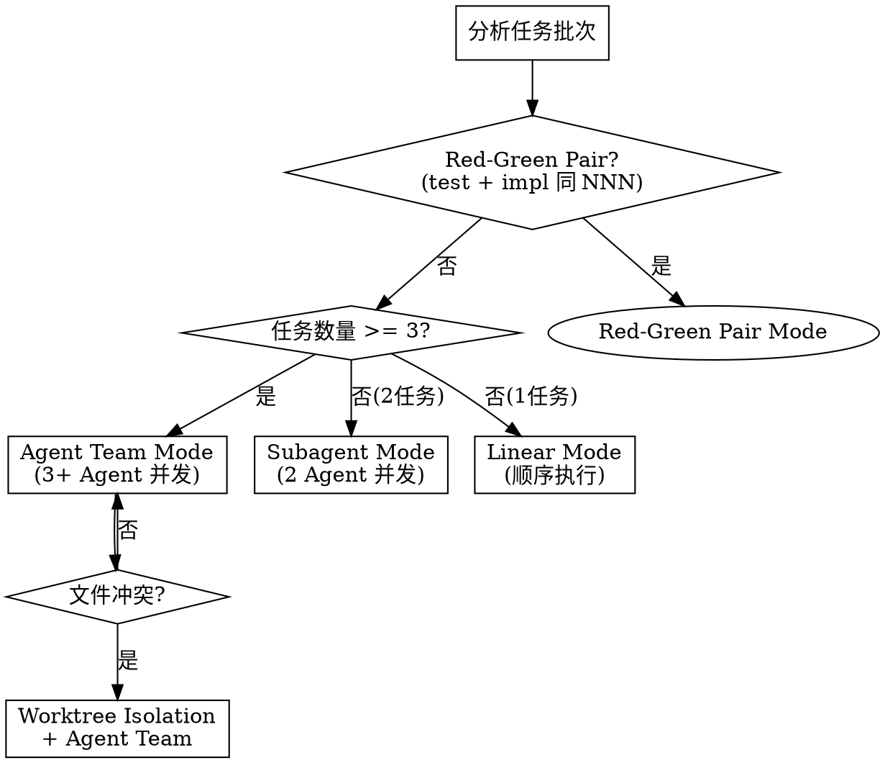

# Parallel Execution Strategy

## Overview

Agent-Teams 通过集成 `superpowers:agent-team-driven-development` 实现真正的并发执行能力，而非依赖原生的 subagent 机制。

## Execution Mode Selection



## Execution Modes

### Mode 1: Agent Team (推荐用于 3+ 任务)

**特点**:
- 团队成员可直接通信
- 共享任务列表自协调
- 适合需要协作的复杂任务

**配置**:
```yaml
execution:
  mode: "agent_team"
  teammates:
    - role: "implementer"
      tasks: ["task-001", "task-002"]
      files: ["src/auth/*.py"]
    - role: "implementer"
      tasks: ["task-003", "task-004"]
      files: ["src/api/*.py"]
    - role: "reviewer"
      tasks: ["review-all"]
      files: ["src/"]
  max_parallel: 3
```

**调用方式**:
```
Skill("superpowers:agent-team-driven-development")
```

### Mode 2: Subagent (用于 2 任务)

**特点**:
- 结果仅返回给调用者
- 无跨 agent 通信
- Token 成本较低

**配置**:
```yaml
execution:
  mode: "subagent"
  agents:
    - task: "task-001"
      type: "general-purpose"
    - task: "task-002"
      type: "general-purpose"
```

**调用方式**:
```bash
Agent tool (并行调用两个 agent)
```

### Mode 3: Red-Green Pair (BDD 专用)

**特点**:
- 测试 agent 先执行，确认 Red 状态
- 实现 agent 后执行，确认 Green 状态
- 多个配对可并行运行

**配置**:
```yaml
execution:
  mode: "red_green_pair"
  pairs:
    - test_task: "task-002-auth-test"
      impl_task: "task-002-auth-impl"
    - test_task: "task-003-user-test"
      impl_task: "task-003-user-impl"
  parallel_pairs: true  # 多配对并行
```

### Mode 4: Linear (顺序执行)

**特点**:
- 单任务顺序执行
- 用于无法拆分的任务

**使用场景**:
- 只有 1 个任务
- 所有任务有强依赖关系
- 文件高度耦合无法隔离

## Teammate Roles

| Role | Responsibility | Spawn Prompt Template |
|------|---------------|----------------------|
| **Implementer** | 执行编码任务，遵循 TDD/BDD | `[implementer-role.md]` |
| **Reviewer** | 验证质量、安全、合规 | `[reviewer-role.md]` |
| **Architect** | 解决跨模块问题，维护一致性 | `[architect-role.md]` |

详见 frad-dotclaude superpowers 的角色文档。

## Worktree Isolation

**触发条件**: 同批次任务编辑重叠文件

**流程**:
```bash
# 创建隔离工作树
git worktree add .claude/worktrees/<task-id> -b <task-branch>

# Agent 在隔离环境中执行
Agent({
  isolation: "worktree",
  prompt: "Execute task in isolated worktree..."
})

# 完成后合并
git worktree remove .claude/worktrees/<task-id>
```

## Parallel Limits

```yaml
# ecf_config.yaml
execution:
  max_parallel_agents: 5  # 最大并行 agent 数
  batch_size: 3-6         # 每批次任务数
  red_green_pairs: true   # 启用 Red-Green 配对模式
```

## Integration with Executing-Plans

**执行入口**: 使用 `/ecf-execute` 或 `Skill("ecf-execute")` 作为强制并发入口

**当前实现**:
```
/ecf-execute → 分析批次 → 选择执行模式 → Agent Team / Subagent 并发
```

**已实现的并发逻辑**:
- Phase 3.1: 分析任务批次（Red-Green 配对检测）
- Phase 3.2: 选择执行模式（Agent Team / Subagent / Linear）
- Phase 3.3: 调用 `superpowers:agent-team-driven-development` 执行并发任务

**Red-Green Pair**: 配对内顺序执行（test → impl），多配对并行
**Agent Team**: 3+ 任务并发，团队成员可通信
**Subagent**: 2 任务并行，无通信
**Linear**: 单任务或强依赖顺序执行（仅作为 fallback）

**警告**: 不要使用 `superpowers:executing-plans` 作为入口，它可能输出顺序执行选择而非强制并发。

## Verification Gate

每批次完成后强制验证：

```
📋 批次验证报告
━━━━━━━━━━━━━━━━━━━━
Task-001: ✅ PASS (tests: 3 passed)
Task-002: ✅ PASS (tests: 2 passed)
Task-003: ❌ FAIL (tests: 1 failed)
━━━━━━━━━━━━━━━━━━━━
并行 Agent: 3 个活跃
验证状态: 需修复 Task-003
```

**规则**:
- 所有任务 PASS 才进入下一批次
- FAIL 任务保持在 `in_progress`
- 修复后重新验证，最多 2 次重试

## Red Flags - Parallel Execution

- 所有任务顺序执行，无并行
- 使用 Agent Team 但任务只有 1 个
- 同批次任务编辑同一文件但无 worktree 隔离
- 跳过验证直接标记完成
- Agent Team 成员超过 max_parallel_agents

**遇到以上**: 从执行模式选择重新开始。

## References

- [agent-team-driven-development](https://github.com/frad-dotclaude/superpowers) - frad-dotclaude 版本的并发 skill
- [batch-execution-playbook.md](./batch-execution-playbook.md) - 批次执行 playbook
- [implementer-role.md](./implementer-role.md) - Implementer 角色模板
- [reviewer-role.md](./reviewer-role.md) - Reviewer 角色模板