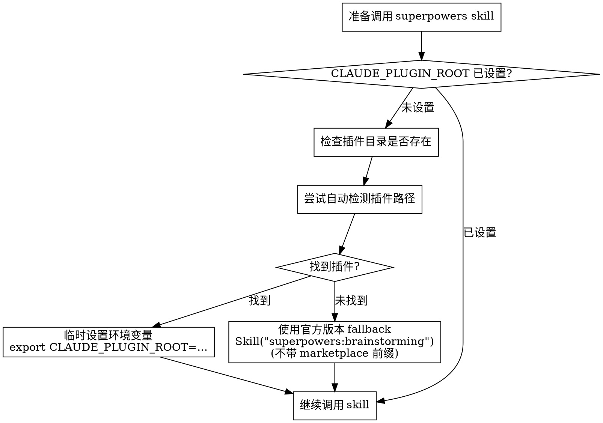

# Superpowers Environment Check

## Overview

在调用 `superpowers:*` skills 前，必须检查 `CLAUDE_PLUGIN_ROOT` 环境变量是否正确设置。frad-dotclaude 版本的 superpowers skills（brainstorming、writing-plans、executing-plans）依赖此变量来启动 Superpower Loop。

## Problem

当 `CLAUDE_PLUGIN_ROOT` 环境变量缺失时：

```
"${CLAUDE_PLUGIN_ROOT}/scripts/setup-superpower-loop.sh" "..."
↓
""/scripts/setup-superpower-loop.sh" "..."  (空路径)
↓
/scripts/setup-superpower-loop.sh           (找不到脚本)
↓
Skill 执行卡住，无任何输出
```

## Detection Flow



## Detection Steps

### Step 1: Check Environment Variable

```bash
# 检查 CLAUDE_PLUGIN_ROOT 是否设置且非空
if [[ -n "${CLAUDE_PLUGIN_ROOT:-}" ]]; then
    echo "✅ CLAUDE_PLUGIN_ROOT 已设置: ${CLAUDE_PLUGIN_ROOT}"
    # 继续正常流程
else
    echo "⚠️ CLAUDE_PLUGIN_ROOT 未设置"
    # 进入 Step 2
fi
```

### Step 2: Auto-Detect Plugin Path

尝试检测 frad-dotclaude superpowers 插件位置：

```bash
# 方法 1: 检查 marketplace 目录
FRAD_PLUGIN_PATH="${HOME}/.claude/plugins/marketplaces/frad-dotclaude/superpowers"
if [[ -d "$FRAD_PLUGIN_PATH/scripts/setup-superpower-loop.sh" ]]; then
    export CLAUDE_PLUGIN_ROOT="$FRAD_PLUGIN_PATH"
    echo "✅ 自动检测并设置: CLAUDE_PLUGIN_ROOT=$FRAD_PLUGIN_PATH"
fi

# 方法 2: 检查 cache 目录（备用）
CACHE_PLUGIN_PATH="${HOME}/.claude/plugins/cache/frad-dotclaude/superpowers/2.1.0"
if [[ -d "$CACHE_PLUGIN_PATH/scripts/setup-superpower-loop.sh" ]]; then
    export CLAUDE_PLUGIN_ROOT="$CACHE_PLUGIN_PATH"
    echo "✅ 自动检测并设置: CLAUDE_PLUGIN_ROOT=$CACHE_PLUGIN_PATH"
fi
```

### Step 3: Fallback to Official Version

如果无法检测到 frad-dotclaude 插件，使用官方版本（不依赖 Superpower Loop）：

```bash
# 官方版本路径
OFFICIAL_PATH="${HOME}/.claude/plugins/cache/claude-plugins-official/superpowers/5.0.7"
if [[ -d "$OFFICIAL_PATH" ]]; then
    echo "⚠️ frad-dotclaude 插件未找到，使用官方版本 fallback"
    # 调用时不带 marketplace 前缀，系统会解析到官方版本
fi
```

## Skill Invocation Strategy

| 检测结果 | 调用方式 |
|----------|----------|
| `CLAUDE_PLUGIN_ROOT` 已设置 | `Skill("superpowers:brainstorming")` - 正常调用 |
| 自动检测成功 | 先 `export`，再 `Skill("superpowers:brainstorming")` |
| 需要 fallback | 直接调用官方版本（skill 系统自动选择） |

**重要**: Skill tool 的名称解析顺序由 Claude Code 决定。当环境变量设置后，skill 可能会找到正确的版本。

## Affected Skills

以下 skills 依赖 `CLAUDE_PLUGIN_ROOT`（frad-dotclaude 版本）：

| Skill | First Action | 依赖 |
|-------|--------------|------|
| `brainstorming` | 启动 Superpower Loop | `${CLAUDE_PLUGIN_ROOT}/scripts/setup-superpower-loop.sh` |
| `writing-plans` | 启动 Superpower Loop | `${CLAUDE_PLUGIN_ROOT}/scripts/setup-superpower-loop.sh` |
| `executing-plans` | 启动 Superpower Loop | `${CLAUDE_PLUGIN_ROOT}/scripts/setup-superpower-loop.sh` |

## Integration with Agent-Teams

在 ecf 的 workflow 中，每个 superpowers skill 调用前插入环境检查：

**修改后的 workflow（示例 - refactor）**:

```yaml
workflow:
  - step: 1
    layer: orchestration
    action: intent_recognition
  - step: 2
    layer: contract
    actions:
      - env_check              # 新增：环境检查
      - Skill("superpowers:brainstorming")
  - step: 3
    layer: execution
    actions:
      - env_check              # 新增：环境检查
      - Skill("superpowers:writing-plans")
      - env_check              # 新增：环境检查
      - Skill("superpowers:executing-plans")
```

## Implementation in SKILL.md

在 ecf SKILL.md 中添加环境检查部分（放在 Architecture 之后）：

```markdown
## Superpowers Environment Check

**Before calling any `superpowers:*` skill, run this check sequence.**

### Quick Check

```bash
# 一行命令检测并设置
export CLAUDE_PLUGIN_ROOT="${CLAUDE_PLUGIN_ROOT:-$(ls -d ~/.claude/plugins/marketplaces/frad-dotclaude/superpowers 2>/dev/null || ls -d ~/.claude/plugins/cache/frad-dotclaude/superpowers/*/ 2>/dev/null | head -1)}"
```

### Check Result Actions

| Result | Action |
|--------|--------|
| 非空路径 | `✅ 环境已就绪` - 继续调用 skill |
| 空路径 | `⚠️ 使用官方版本 fallback` - skill 系统自动选择 |
```

## Red Flags - Environment Check

- 跳过环境检查直接调用 skill
- 假设环境变量"应该已经设置"
- 调用 superpowers skill 时看到卡住但未检查环境
- 认为"这只是网络问题"或其他原因

**遇到以上情况**: 立即执行环境检查步骤。

## Testing

验证环境检查机制：

```bash
# 测试 1: 环境变量已设置
export CLAUDE_PLUGIN_ROOT="/path/to/plugin"
# 预期: 检测通过，skill 正常执行

# 测试 2: 环境变量未设置，插件存在
unset CLAUDE_PLUGIN_ROOT
# 预期: 自动检测并设置，skill 正常执行

# 测试 3: 环境变量未设置，插件不存在
unset CLAUDE_PLUGIN_ROOT
rm -rf ~/.claude/plugins/marketplaces/frad-dotclaude/
# 预期: 使用官方版本 fallback
```