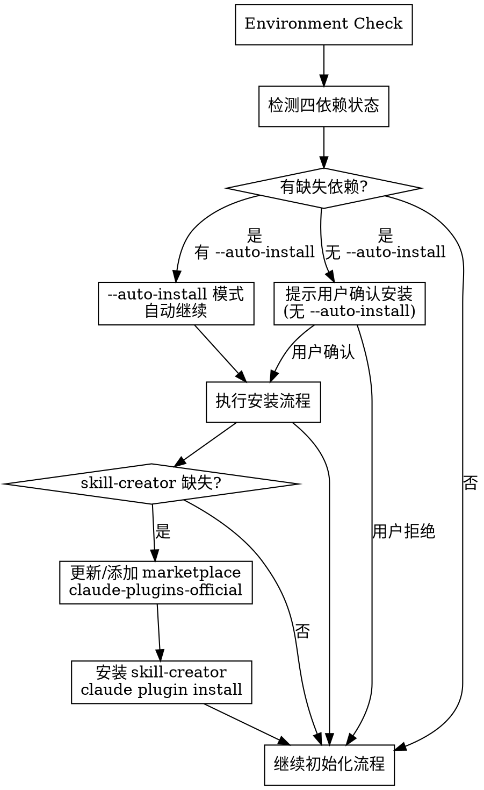

# EasyCodingFlow Project Initialization

Initialize project directory structure for ecf skill workflow.

## Overview

Creates required directories and templates for ecf multi-agent orchestration. Core structure enables OpenSpec proposals, knowledge base, and work plan storage.

**Core principle:** Idempotent initialization - safe to run multiple times, only creates missing components.

**NEW:** Auto-install missing dependencies (OpenSpec, Compound Engineering, Superpowers) with `--auto-install` flag.

## When to Use

- New project setup for ecf workflow
- Agent-teams reports "Project not initialized"
- Missing `docs/solutions/` or `.claude/ecf_config.yaml`
- User requests `/ecf-init`

## Arguments

- `--force`: Force re-initialization, backup existing files to `.backup/`
- `--minimal`: Create directories only, skip template deployment
- `--auto-install`: Automatically install missing dependencies
- `--analyze`: 对存量项目执行深度代码分析，生成 architectures 文档内容

## Directory Structure

```
docs/
├── solutions/           # Knowledge base (required)
│   ├── README.md
│   └── .template.md
├── openspec/            # OpenSpec artifacts
│   ├── README.md
│   ├── proposals/
│   ├── templates/
│   ├── changes/
│   └── architectures/   # System architecture docs
│       ├── architecture.md
│       ├── modules.md
│       └── changes-index.md
└── plans/               # Work plans
    └── README.md
.claude/
├── ecf_config.yaml
└── .ecf-init.local.md  # Init state marker
```

## Execution Flow

```
Parse args → Environment Check → (Auto-install if --auto-install) → Check existing → (Backup if --force) → Create dirs → Deploy templates → Record state → Summary
```

## Environment Check (Pre-flight)

**⚠️ 必须在初始化前检测依赖环境安装状态。**

检测四个核心依赖（详细检测命令见主技能 [dependency-check.md](../ecf/references/dependency-check.md)）：

| 依赖 | 检测方法 | 影响层级 |
|------|----------|----------|
| OpenSpec CLI + Skills | `openspec --version` + `.claude/skills/openspec-*` | Contract Layer |
| Compound Engineering | `~/.claude/plugins/cache/compound-engineering-plugin/` | Knowledge Layer |
| Superpowers@frad-dotclaude | `CLAUDE_PLUGIN_ROOT` + `setup-superpower-loop.sh` | Execution Layer |
| skill-creator | `~/.claude/skills/skill-creator/` 或 `~/.claude/plugins/cache/claude-plugins-official/skill-creator/` | Skills Development |

**快速检测**:

```bash
# OpenSpec
openspec --version &>/dev/null && echo "✅ CLI" || echo "⚠️ CLI 未安装"

# CE
ls ~/.claude/plugins/cache/compound-engineering-plugin/ 2>/dev/null | grep -q . && echo "✅ CE" || echo "⚠️ CE 未安装"

# Superpowers
export CLAUDE_PLUGIN_ROOT="${CLAUDE_PLUGIN_ROOT:-$(ls -d ~/.claude/plugins/marketplaces/frad-dotclaude/superpowers 2>/dev/null || ls -d ~/.claude/plugins/cache/frad-dotclaude/superpowers/*/ 2>/dev/null | head -1)}"
[[ -n "$CLAUDE_PLUGIN_ROOT" && -f "$CLAUDE_PLUGIN_ROOT/scripts/setup-superpower-loop.sh" ]] && echo "✅ SP" || echo "⚠️ SP 未就绪"

# skill-creator（检测两个安装位置）
SC_INSTALLED=false
if [[ -d ~/.claude/skills/skill-creator ]]; then
  SC_INSTALLED=true
fi
if [[ -d ~/.claude/plugins/cache/claude-plugins-official/skill-creator ]]; then
  SC_INSTALLED=true
fi
$SC_INSTALLED && echo "✅ skill-creator" || echo "⚠️ skill-creator 未安装"
```

### Auto-Install Flow

**使用 `--auto-install` 参数时自动安装缺失依赖。**



### Installation Commands

#### 1. OpenSpec CLI + Skills

```bash
# Install CLI
npm install -g @fission-ai/openspec@latest
openspec --version

# Initialize project-level skills
openspec init
ls .claude/skills/openspec-*
```

#### 2. Compound Engineering Plugin

```
/plugin marketplace add EveryInc/compound-engineering-plugin
/plugin install compound-engineering
```

#### 3. Superpowers@frad-dotclaude

```
/plugin marketplace add frad-dotclaude/superpowers
/plugin install superpowers@frad-dotclaude
```

设置环境变量（写入 ~/.bashrc 或 ~/.zshrc）:
```bash
export CLAUDE_PLUGIN_ROOT=~/.claude/plugins/marketplaces/frad-dotclaude/superpowers
```

#### 4. skill-creator Plugin (Official)

**自动安装**（`--auto-install` 模式）：
```bash
# 检查 marketplace 是否存在，不存在则添加
claude plugin marketplace list 2>/dev/null | grep -q claude-plugins-official || claude plugin marketplace add claude-plugins-official

# 更新 marketplace 获取最新插件列表
claude plugin marketplace update claude-plugins-official

# 安装 skill-creator
claude plugin install skill-creator@claude-plugins-official
```

**手动安装**（在 Claude Code 中运行）：
```
/plugin marketplace update claude-plugins-official
/plugin install skill-creator@claude-plugins-official
```

**用途**: Skills开发工作流的执行层使用 skill-creator TDD 流程。安装后检测位置：`~/.claude/skills/skill-creator/` 或 `~/.claude/plugins/cache/claude-plugins-official/skill-creator/`。

## Initialization Scenarios

### Scenario Detection

```bash
has_code_files=$(find . -name "*.py" -o -name "*.js" -o -name "*.ts" -o -name "*.rb" -o -name "*.go" 2>/dev/null | grep -v node_modules | grep -v vendor | head -5)
[ -n "$has_code_files" ] && project_status="存量项目" || project_status="空项目"
```

### Empty Project Flow

空项目直接创建空白模板结构。

### Legacy Project Flow

存量项目执行深度代码分析，生成 architecture.md 和 modules.md 内容。

详细分析流程见 [architectures-templates.md](../ecf/references/architectures-templates.md)。

## Implementation

**Step 1: Parse Arguments**
```bash
force=false; minimal=false; auto_install=false
for arg in $ARGUMENTS; do
  case $arg in
    --force) force=true ;;
    --minimal) minimal=true ;;
    --auto-install) auto_install=true ;;
  esac
done
```

**Step 2: Environment Check + Auto-Install**

```bash
# 执行依赖检测
# 如果有缺失且 auto_install=true，执行自动安装
# 如果有缺失且 auto_install=false，提示用户手动安装命令
```

**Step 3: Check Existing Structure**
```bash
dirs_to_check=(docs/solutions docs/openspec docs/openspec/proposals docs/openspec/templates docs/openspec/changes docs/plans .claude)
for dir in "${dirs_to_check[@]}"; do
  [ -d "$dir" ] && echo "✅ $dir" || echo "⚠️ $dir (missing)"
done
```

**Step 4: Create Directories**
```bash
mkdir -p docs/solutions docs/openspec/proposals docs/openspec/templates docs/openspec/changes docs/openspec/architectures docs/plans .claude
```

**Step 5: Deploy Templates (if not minimal)**

Create README.md files and template files in each directory.

**Step 6: Record State**

Create `.claude/.ecf-init.local.md`:
```markdown
# Agent-Teams Initialization State

Initialized: [timestamp]
Project Status: [空项目/存量项目]
Auto-Install: [true/false]

## Dependencies Status
- OpenSpec CLI: [version/not_installed]
- Compound Engineering: [installed/not_installed]
- Superpowers: [frad-dotclaude/official/not_installed]
```

**Step 7: Architecture Docs Generation (if not minimal)**

空项目场景：写入空白模板
存量项目场景：执行深度代码分析

## Red Flags - STOP

- Creating directories outside project root
- Overwriting user files without `--force`
- Leaving partial initialization state
- Auto-install 失败后未记录 Degraded 状态

## Initialization Completion Validation

After all initialization steps complete, run self-validation to verify all required artifacts created:

```bash
🔍 初始化完成验证
━━━━━━━━━━━━━━━━━━━━━━━━━━━━━
✓ docs/solutions/ 目录已创建 ✅
✓ docs/plans/ 目录已创建 ✅
✓ docs/openspec/ 目录结构已创建 ✅
✓ .claude/ecf_config.yaml 已生成且非空 ✅
✓ .claude/.ecf-init.local.md 已写入且非空 ✅
━━━━━━━━━━━━━━━━━━━━━━━━━━━━━
✅ 验证通过
```

**If any item fails**:
- Report which directory/file is missing
- Do NOT claim initialization complete
- Prompt user to re-run initialization

## Summary Output

```
🔍 Environment Check
━━━━━━━━━━━━━━━━━━━━━━━━━━━━━
OpenSpec CLI:         [✅ 版本号 / ⚠️ 未安装]
OpenSpec Skills:      [✅ 已安装 / ⚠️ 未安装]
Compound Engineering: [✅ 已安装 / ⚠️ 未安装]
Superpowers:          [✅ frad-dotclaude / ⚠️ 未安装]
skill-creator:        [✅ 已安装 / ⚠️ 未安装 / 🔄 自动安装中]
━━━━━━━━━━━━━━━━━━━━━━━━━━━━━
[如有 --auto-install，显示安装结果]

📊 Initialization Summary
━━━━━━━━━━━━━━━━━━━━━━━━━━━━━
项目状态: [空项目/存量项目]
目录创建: [count] 个
模版部署: [deployed/skipped]
架构文档: [空白模板/基于分析生成]
配置生成: ✅
━━━━━━━━━━━━━━━━━━━━━━━━━━━━━
初始化完成，可以使用 ecf skill
```

## References

- Configuration schema: See `../ecf/references/config-schema.md`
- Dependency check: See `../ecf/references/dependency-check.md`
- Architecture templates: See `../ecf/references/architectures-templates.md`
- Phase completion validation: See `../ecf/references/phase-completion-validation.md`
- OpenSpec README: See `references/OpenSpec_README.md`
- CE Plugin README: See `references/compound-engineering-plugin_README.md`