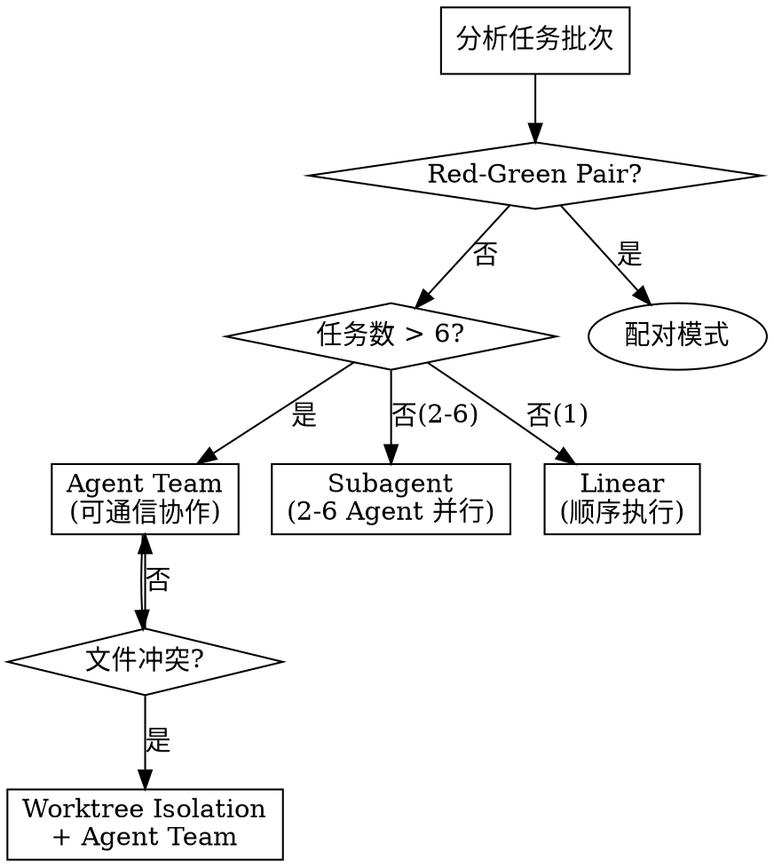

# Workflow Templates

> **权威源声明**: 此文件是 EasyCodingFlow 工作流模板的唯一权威定义。
> SKILL.md、CLAUDE.md、README.md 中的工作流表格均为简化摘要，应引用此文件作为完整参考。

## 模板索引

| 模板名称 | 场景 | 关键词 | 工作流概览 |
|----------|------|--------|------------|
| new_feature | 新需求开发 | 开发、新功能、实现 | OpenSpec → Brainstorming → Writing-Plans → **ecf-execute** → ecf-verify → **opsx:archive** → Compound |
| bug_fix | Bug修复 | bug、报错、失败 | Systematic-Debugging → Fix → ecf-verify → Compound |
| refactor | 代码重构 | 重构、优化结构 | Brainstorming → Writing-Plans → **ecf-execute** → ecf-verify → Compound |
| code_review | Code Review | review、审查 | **ce-review** → Compound |
| skill_development | Skills开发 | skill、技能、SKILL.md | OpenSpec → **skill-creator** → skill-quality-verification → **opsx:archive** → Compound |
| incremental | 增量开发 | 扩展、迭代、增强 | OpenSpec → Executing-Plans → ecf-verify → **opsx:archive** → Compound |
| documentation | 文档更新 | 文档、readme | Direct Execution |
| test_coverage | 测试补齐 | 测试、用例 | BDD → ecf-verify → Compound |

**关键说明**:
- **Archive 步骤**: 使用 OpenSpec 发起的变更（new_feature、skill_development、incremental）必须调用 `/opsx:archive` 完成生命周期闭环
- **ecf-execute**: 执行层强制使用 `/ecf-execute` 作为并发入口，而非 `superpowers:executing-plans`
- **Skills开发特例**: 执行层使用 `skill-creator`（TDD），验证层使用 `skill-quality-verification`（而非 ecf-verify）

## 工作流模板定义

### 执行策略配置

**并发执行模式**（基于 `superpowers:agent-team-driven-development`）:

| 任务数量 | 执行模式 | 说明 |
|----------|----------|------|
| 1 | Linear | 单任务顺序执行 |
| 2-6 | Subagent | 2-6 个 Agent 并行，无通信 |
| >6 | Agent Team | 6+ Agent 并发，可通信协作 |
| Red-Green Pair | 配对模式 | 测试→实现顺序，多配对可并行 |

**执行策略决策流程**:



---

### Template: new_feature (新需求开发)

```yaml
name: new_feature
layers:
  - orchestration
  - contract
  - execution
  - verification  # 新增验证层
  - knowledge
workflow:
  - step: 1
    layer: orchestration
    action: intent_recognition
  - step: 2
    layer: contract
    actions:
      - /opsx:propose
      - Skill("superpowers:brainstorming")
  - step: 3
    layer: execution
    actions:
      - Skill("superpowers:writing-plans")
      - Skill("ecf-execute")  # 强制并发执行入口
      - Skill("superpowers:behavior-driven-development")
    execution_config:  # 新增：并发执行配置
      mode: "auto"  # auto | agent_team | subagent | linear
      max_parallel_agents: 5
      batch_size: 3-6
      red_green_pairs: true
      load_skills:  # 执行前必须加载的 skills
        - "superpowers:agent-team-driven-development"
        - "superpowers:behavior-driven-development"
  - step: 4  # 新增
    layer: verification
    action: Skill("ecf-verify")
  - step: 5
    layer: knowledge
    action: ce:compound Keep
```

### Template: bug_fix (Bug修复)

```yaml
name: bug_fix
layers:
  - orchestration
  - execution
  - verification  # 新增验证层
  - knowledge  # 跳过 contract 层
workflow:
  - step: 1
    layer: orchestration
    action: intent_recognition
  - step: 2
    layer: execution
    actions:
      - Skill("superpowers:systematic-debugging")
      - fix_impl
  - step: 3  # 新增
    layer: verification
    action: Skill("ecf-verify")
  - step: 4
    layer: knowledge
    action: ce:compound Keep
```

### Template: refactor (代码重构)

```yaml
name: refactor
layers:
  - orchestration
  - contract
  - execution
  - verification  # 新增验证层
  - knowledge
workflow:
  - step: 1
    layer: orchestration
    action: intent_recognition
  - step: 2
    layer: contract
    action: Skill("superpowers:brainstorming")
  - step: 3
    layer: execution
    actions:
      - Skill("superpowers:writing-plans")
      - Skill("ecf-execute")  # ecf 项目强制使用 ecf-execute 作为执行层入口
    execution_config:  # 新增：并发执行配置
      mode: "auto"
      max_parallel_agents: 4  # 重构通常涉及更多模块间协调
      batch_size: 3-5
      red_green_pairs: true
      load_skills:
        - "superpowers:agent-team-driven-development"
        - "superpowers:behavior-driven-development"
  - step: 4  # 新增
    layer: verification
    action: Skill("ecf-verify")
  - step: 5
    layer: knowledge
    action: ce:compound Consolidate
```

### Template: code_review

```yaml
name: code_review
layers:
  - orchestration
  - execution
  - knowledge
workflow:
  - step: 1
    layer: orchestration
    action: intent_recognition
  - step: 2
    layer: execution
    action: Skill("compound-engineering:ce-review")
  - step: 3
    layer: knowledge
    action: ce:compound Update
```

**Note**: Uses Compound Engineering's multi-agent review (requires CE plugin). If CE not installed, falls back to Superpowers review skills.

### Template: skill_development (技能开发)

```yaml
name: skill_development
layers:
  - orchestration
  - contract
  - execution
  - verification
  - knowledge
workflow:
  - step: 1
    layer: orchestration
    action: intent_recognition
  - step: 2
    layer: contract
    action: /opsx:propose
  - step: 3
    layer: execution
    action: Skill("skill-creator")  # TDD flow with eval-viewer
  - step: 4
    layer: verification
    action: Skill("skill-quality-verification")  # NOT ecf-verify
  - step: 5
    layer: knowledge
    actions:
      - /opsx:archive  # REQUIRED: OpenSpec lifecycle closure
      - ce:compound
```

**Note**: Skills开发工作流与新需求开发的关键差异：
- Execution layer 使用 `skill-creator`（**TDD流程包含 eval 验证环节**），而非 `superpowers:writing-plans`
- **所有技能开发场景**（新增技能、修改技能、优化技能、修复技能bug、评估技能）都必须完整执行 `skill-creator` TDD流程，**eval 验证环节禁止跳过**
- Verification layer 使用 `skill-quality-verification`（检查frontmatter/CSO），而非 `ecf-verify`
- 必须调用 `/opsx:archive` 完成变更生命周期闭环
- **意图识别强制路由**: 任何包含 skill 相关关键词的请求都会被强制分类为 `skill_development`，即使包含 `bug`, `fix`, `review` 等其他关键词

### Template: incremental (增量开发)

```yaml
name: incremental
layers:
  - orchestration
  - contract
  - execution
  - verification  # 新增验证层
  - knowledge
workflow:
  - step: 1
    layer: orchestration
    action: intent_recognition
  - step: 2
    layer: contract
    action: /opsx:propose (变更套件)
  - step: 3
    layer: execution
    action: Skill("superpowers:executing-plans:selective")
  - step: 4  # 新增
    layer: verification
    action: Skill("ecf-verify")
  - step: 5
    layer: knowledge
    action: ce:compound Update
```

### Template: documentation

```yaml
name: documentation
layers:
  - orchestration
  - execution
workflow:
  - step: 1
    layer: orchestration
    action: intent_recognition
  - step: 2
    layer: execution
    action: direct_impl
  # knowledge 可选
```

### Template: test_coverage

```yaml
name: test_coverage
layers:
  - orchestration
  - execution
  - verification  # 新增验证层
  - knowledge
workflow:
  - step: 1
    layer: orchestration
    action: intent_recognition
  - step: 2
    layer: execution
    action: Skill("superpowers:behavior-driven-development")
    execution_config:  # 新增：测试用例并发执行
      mode: "red_green_pair"  # 测试优先使用配对模式
      max_parallel_agents: 4
      parallel_pairs: true  # 多个测试配对并行
      load_skills:
        - "superpowers:agent-team-driven-development"
        - "superpowers:behavior-driven-development"
  - step: 3  # 新增
    layer: verification
    action: Skill("ecf-verify")
  - step: 4
    layer: knowledge
    action: ce:compound Update
```

---

## 验证层说明

**一致性验证** (verification layer) 在执行层完成后自动调用:

- **目的**: 验证 spec ↔ design ↔ code ↔ tests 一致性
- **方法**: 3 个并行子代理进行语义分析
- **产物**: verification-report.md (traceability matrix + 不一致报告)
- **修复**: 用户选择后执行修复并重新验证

**跳过验证**: 仅在 `documentation` 等不涉及代码的场景可跳过。

---

## 执行层并发配置说明

### execution_config 字段详解

```yaml
execution_config:
  mode: "auto"              # auto | agent_team | subagent | linear | red_green_pair
  max_parallel_agents: 5    # 最大并行 Agent 数
  batch_size: 3-6           # 每批次任务数范围
  red_green_pairs: true     # 启用测试-实现配对模式
  parallel_pairs: true      # 多配对并行执行
  worktree_isolation: true  # 文件冲突时启用 worktree 隔离
  load_skills:              # 执行前必须加载的 skills
    - "superpowers:agent-team-driven-development"
    - "superpowers:behavior-driven-development"
```

### Mode 选择逻辑

| Mode | 使用场景 | Agent 数 | 通信能力 |
|------|----------|----------|----------|
| `agent_team` | >6 独立任务，需协作 | 6+ | ✅ 可互发消息 |
| `subagent` | 2-6 独立任务 | 2-6 | ❌ 仅返回调用者 |
| `red_green_pair` | BDD 测试+实现 | 2/配对 | ✅ 配对内顺序 |
| `linear` | 单任务或强依赖 | 1 | ❌ 无 |

### Agent Team vs Subagent

**Agent Team**（推荐用于复杂任务）:
- 团队成员可直接通信
- 共享任务列表自协调
- 适合需要讨论和协作的场景
- 调用: `Skill("superpowers:agent-team-driven-development")`

**Subagent**（用于简单并行）:
- 结果仅返回给调用者
- 无跨 agent 通信
- Token 成本较低
- 调用: 并行使用 `Agent` tool

### 必加载 Skills

**执行入口**: `/ecf-execute` 或 `Skill("ecf-execute")` - **强制并发执行入口**

在 `ecf-execute` 执行流程中，必须先加载：

1. `superpowers:agent-team-driven-development` - 提供并发协调能力
2. `superpowers:behavior-driven-development` - 提供测试驱动开发能力

这两个 skills 是并发执行的基础设施。

**注意**: 不要使用 `superpowers:executing-plans` 作为入口，它可能返回顺序执行选择。

---

## 自定义模板扩展

用户可在配置文件中添加自定义模板：

```yaml
custom_templates:
  - name: "快速原型"
    workflow: ["brainstorming", "direct-impl"]
    skip_tests: true
    
  - name: "严格质量"
    workflow: ["openspec", "brainstorming", "writing-plans", "tdd-execution", "review", "compound"]
    coverage_threshold: 80
```

---

## 场景流转规则表

**参考来源**: SKILL.md 的"工作流自动流转机制"章节引用此处的完整流转规则。

编排层在各工作流场景中，按照以下规则自动（或经用户确认后）进入下一跳。

### 完成信号说明

| 信号 | 检测方式 |
|------|----------|
| `propose_complete` | openspec/changes/ 下存在 proposal.md + design.md + tasks.md |
| `brainstorming_complete` | 输出中包含 `BRAINSTORMING_COMPLETE` promise |
| `writing_plans_complete` | docs/plans/ 下有新建计划文件 |
| `exec_complete` | ecf-execute 输出包含所有批次完成的执行摘要 |
| `skill_creator_complete` | evals 工作区已创建且 eval 验证结果无 FAIL |
| `verify_complete` | 验证报告已写入（ecf-verify 或 skill-quality-verification） |
| `archive_complete` | 变更已归档到 openspec/changes/archive/ |
| `compound_complete` | 解决方案文档已写入 docs/solutions/ |
| `debug_complete` | systematic-debugging 完成 root cause 分析 |
| `fix_applied` | Bug 修复已应用 |

### 场景: new_feature（新需求开发）

| 步骤 | 完成信号 | 下一跳 | 手动模式下交付摘要 | 自动模式 |
|------|----------|--------|-------------------|----------|
| 意图识别 | 输出识别结果 | `/opsx:propose` | —（流程必需） | 自动 |
| `/opsx:propose` | `propose_complete` | `brainstorming` | 变更目录路径 + proposal/design/tasks 列表 + AskUserQuestion | 自动 |
| `brainstorming` | `brainstorming_complete` | `writing-plans` | 设计文档路径 + 关键决策摘要 + AskUserQuestion | 自动 |
| `writing-plans` | `writing_plans_complete` | `ecf-execute` | 计划文件路径 + 任务概要 + 自动纠正提示 + AskUserQuestion | 自动 + 自动纠正 |
| `ecf-execute` | `exec_complete` | `ecf-verify` | 执行摘要 + 变更文件列表 + AskUserQuestion | 自动 |
| `ecf-verify` | `verify_complete` | `/opsx:archive` | 验证报告路径 + 结果 + AskUserQuestion | 自动 |
| `/opsx:archive` | `archive_complete` | `ce:compound` | —（流程必需） | 自动 |
| `ce:compound` | `compound_complete` | 完成 | —（流程结束） | 自动 |

### 场景: skill_development（技能开发）

| 步骤 | 完成信号 | 下一跳 | 手动模式下交付摘要 | 自动模式 |
|------|----------|--------|-------------------|----------|
| 意图识别 | 输出识别结果 | `/opsx:propose` | —（流程必需） | 自动 |
| `/opsx:propose` | `propose_complete` | `skill-creator` | 变更目录路径 + proposal/design/tasks 列表 + AskUserQuestion | 自动 |
| `skill-creator` | `skill_creator_complete` | `skill-quality-verification` | evals 工作区路径 + 测试结果摘要 + AskUserQuestion | 自动 |
| `skill-quality-verification` | `verify_complete` | `/opsx:archive` | frontmatter/CSO 检查结果 + AskUserQuestion | 自动 |
| `/opsx:archive` | `archive_complete` | `ce:compound` | —（流程必需） | 自动 |
| `ce:compound` | `compound_complete` | 完成 | —（流程结束） | 自动 |

### 场景: refactor（代码重构）

| 步骤 | 完成信号 | 下一跳 | 手动模式下交付摘要 | 自动模式 |
|------|----------|--------|-------------------|----------|
| 意图识别 | 输出识别结果 | `brainstorming` | —（流程必需） | 自动 |
| `brainstorming` | `brainstorming_complete` | `writing-plans` | 设计文档路径 + 关键决策摘要 + AskUserQuestion | 自动 |
| `writing-plans` | `writing_plans_complete` | `ecf-execute` | 计划文件路径 + 任务概要 + 自动纠正提示 + AskUserQuestion | 自动 + 自动纠正 |
| `ecf-execute` | `exec_complete` | `ecf-verify` | 执行摘要 + 变更文件列表 + AskUserQuestion | 自动 |
| `ecf-verify` | `verify_complete` | `ce:compound` | 验证报告路径 + 结果 + AskUserQuestion | 自动 |
| `ce:compound` | `compound_complete` | 完成 | —（流程结束） | 自动 |

### 场景: bug_fix（Bug修复）

| 步骤 | 完成信号 | 下一跳 | 手动模式下交付摘要 | 自动模式 |
|------|----------|--------|-------------------|----------|
| 意图识别 | 输出识别结果 | `systematic-debugging` | —（流程必需） | 自动 |
| `systematic-debugging` | `debug_complete` | fix 应用 | Root cause 分析结果 + AskUserQuestion | 自动 |
| fix 应用 | `fix_applied` | `ecf-verify` | 修复文件列表 + AskUserQuestion | 自动 |
| `ecf-verify` | `verify_complete` | `ce:compound` | 验证报告路径 + 结果 + AskUserQuestion | 自动 |
| `ce:compound` | `compound_complete` | 完成 | —（流程结束） | 自动 |

### 场景: incremental（增量开发）

| 步骤 | 完成信号 | 下一跳 | 手动模式下交付摘要 | 自动模式 |
|------|----------|--------|-------------------|----------|
| 意图识别 | 输出识别结果 | `/opsx:propose` | —（流程必需） | 自动 |
| `/opsx:propose` | `propose_complete` | `ecf-execute` | 变更目录路径 + proposal/design/tasks 列表 + AskUserQuestion | 自动 |
| `ecf-execute` | `exec_complete` | `ecf-verify` | 执行摘要 + 变更文件列表 + AskUserQuestion | 自动 |
| `ecf-verify` | `verify_complete` | `/opsx:archive` | 验证报告路径 + 结果 + AskUserQuestion | 自动 |
| `/opsx:archive` | `archive_complete` | `ce:compound` | —（流程必需） | 自动 |
| `ce:compound` | `compound_complete` | 完成 | —（流程结束） | 自动 |